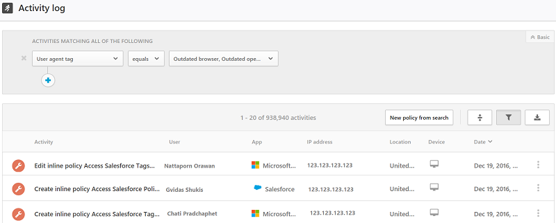

# 활동
Cloud App Security에서는 연결된 앱의 모든 활동을 볼 수 있습니다. 앱 커넥터를 사용해 앱에 Cloud App Security를 연결하면 Cloud App Security에서 수행된 모든 활동이 검색됩니다. 소급 검색 기간은 앱에 따라 다르며 계속 새 활동으로 업데이트됩니다. 

> [!NOTE] 
> Cloud App Security에 의해 모니터링되는 Office 365 활동의 전체 목록은 [Office 365 보안 및 준수 센터에서 감사 로그 검색](https://support.office.com/article/Search-the-audit-log-in-the-Office-365-Security-Compliance-Center-0d4d0f35-390b-4518-800e-0c7ec95e946c?ui=en-US&rs=en-US&ad=US#ID0EABAAA=Audited_activities)을 참조하세요.

**활동 로그**를 필터링하여 특정 활동을 찾을 수 있습니다. 활동을 기준으로 정책을 만든 다음 경고를 받을 활동 및 조치를 정의할 수 있습니다. 특정 파일에 대해 수행된 활동을 검색할 수도 있습니다. 활동의 유형과 각 활동에 대해 가져오는 정보는 앱과 앱이 제공할 수 있는 데이터 종류에 따라 다릅니다. 

예를 들어 다음과 같이 **활동 로그**를 사용하여 조직에서 오래된 운영 체제나 브라우저를 사용하는 사용자를 찾을 수 있습니다. **활동 로그** 페이지에서 앱을 Cloud App Security에 연결한 후 고급 필터를 사용하여 **사용자 에이전트 태그**를 선택합니다. 그런 다음 **오래된 브라우저** 또는 **오래된 운영 체제**를 선택합니다.

 

조직 외부에서 액세스하는 **기밀** 파일이 있는지를 확인하려면 **분류 레이블**을 검색하고 **기밀** 레이블을 선택하도록 **활동 개체** 필터를 설정합니다. **범주**를 검색하고 사무실 IP 주소를 제외하도록 **IP 주소** 필터를 설정합니다. IP 범주는 **설정** 메뉴에서 구성할 수 있습니다. 정의한 필터를 기반으로 활동 정책을 만들고 자동으로 사용자에게 알리려면 **New policy from search**(검색을 통한 새 정책)를 클릭할 수 있습니다.

 

 
기본 필터는 활동 필터링을 시작하기에 좋은 도구를 제공합니다.

 

더 구체적인 활동으로 드릴다운하려면 [고급]을 클릭하여 기본 필터를 확장합니다.

 

## 활동 필터
다음은 적용할 수 있는 활동 필터 목록입니다. 대부분의 필터는 매우 강력한 정책 만들기 도구를 제공하기 위해 NOT뿐만 아니라 여러 값을 지원합니다.  
  
-   활동 ID - 해당 ID로 특정 활동만 검색합니다. 이 필터는 SIEM 에이전트 사용하여 Cloud App Security를 SIEM에 연결할 때 매우 유용하며, Cloud App Security 포털 내에서 경고를 자세히 조사할 수 있습니다.  
  
-   활동 개체 - 활동이 수행된 대상 개체를 검색합니다. 이 필터는 파일, 폴더, 사용자 또는 앱 개체에 적용됩니다. 
    - 활동 개체 ID - 개체의 ID(파일, 폴더, 사용자 또는 앱 ID)입니다.
    - 파일, 폴더 또는 사이트 URL - 특정 문자열로 시작되는 파일, 폴더 및 URL을 선택할 수 있습니다.
    - 대상 개체(파일/폴더) - 특정 파일 또는 폴더를 선택할 수 있습니다. 
    - 항목 - 활동 개체의 이름 또는 ID를 기준으로 검색할 수 있습니다(예: 사용자 이름, 파일, 매개 변수, 사이트). **Activity object Item**(활동 개체 항목) 필터에서 특정 항목을 **포함**하거나, 특정 항목과 **같거나**, 특정 항목으로 **시작**하는 항목을 필터링할지 여부를 선택할 수 있습니다.
    
-   활동 유형 - 응용 프로그램 활동을 검색합니다.

-   관리 활동 – 관리 활동만 검색합니다.  
  
-   경고 ID - 경고 ID를 기준으로 검색합니다.

-   앱 - 특정 앱 내의 활동만 검색합니다.  
  
-   적용된 작업 - 적용된 거버넌스 작업에 따라 차단, 프록시 우회, 해독, 암호화, 암호화 실패, 작업 없음을 기준으로 검색합니다.

-   날짜 - 활동이 발생한 날짜입니다. 필터는 이전/이후 날짜와 날짜 범위를 지원합니다.  
  
-   설명 – 활동 설명의 특정 키워드입니다(예: 설명에 **user** 문자열이 포함된 모든 활동).  
  
-   장치 태그 - 규정 준수, 관리 또는 확인된 장치를 기준으로 검색합니다.

-   장치 유형 - 특정 장치 유형을 사용하여 수행된 활동만 검색합니다(예: 모바일 장치, PC 또는 태블릿의 모든 활동).  
  
-   IP 주소 - 활동을 수행한 원시 IP 주소, 범주 또는 태그입니다.  
    - 원시 IP 주소 - 설정되거나 설정되지 않은 원시 IP 주소와 같거나 같지 않은 활동, 특정 시퀀스로 시작하거나 시작하지 않는 원시 IP 주소의 활동을 검색할 수 있습니다. 
    - IP 범주 - 활동을 수행한 IP 주소 범주입니다(예: 관리 IP 주소 범위의 모든 활동). 범주는 관련 IP 주소를 포함하도록 구성해야 합니다. 단, 미리 구성되며 두 개의 IP 태그(Anonymous proxy 및 Tor)를 포함하는 "Risky"(위험) 범주는 예외입니다. IP 범주를 구성하는 방법을 알아보려면 [요구에 따라 데이터 구성](ip-tags.md)을 참조하세요.  
    - IP 태그 - 활동을 수행한 IP 주소의 태그입니다(예: 익명 프록시 IP 주소의 모든 활동). Cloud App Security는 구성할 수 없는 기본 제공 IP 태그의 집합을 만듭니다. 또한 자체 IP 태그를 구성할 수 있습니다. IP 태그 구성에 대한 자세한 내용은 [요구에 따라 데이터 구성](ip-tags.md)을 참조하세요.
   기본 제공 IP 태그는 다음과 같습니다.
    - Microsoft 앱(그중 14개)
    - 익명 프록시
    - 봇넷(특정 봇넷에 대한 세부 정보 링크를 통해 활동이 봇넷에 의해 수행되었는지 확인)
    - Darknet 검색 IP
    - 맬웨어 C&C 서버
    - 원격 연결 분석기
    - 위성 공급자
    - 스마트 프록시 및 액세스 프록시(고의로 제외)
    - Tor 종료 노드
    - Zscaler

-   가장된 활동 - 다른 사용자의 이름으로 수행된 활동만 검색합니다.  

-   위치 – 활동을 수행한 국가입니다.  

-   일치 정책 – 포털에 설정된 특정 정책에서 일치하는 활동을 검색합니다.  

-   등록된 ISP – 활동을 수행한 ISP입니다.   

-  원본 - 활동이 검색된 원본을 기준으로 검색합니다. 원본은 다음 중 하나일 수 있습니다.
  - 앱 커넥터 - 앱의 API 커넥터에서 직접 가져오는 로그입니다.
  - 앱 커넥터 분석 - API 커넥터의 정보 검사를 기반으로 한 Cloud App Security 강화입니다.
  

-   사용자 – 활동을 수행한 사용자입니다. 도메인, 그룹, 이름 또는 조직을 기준으로 필터링할 수 있습니다. 특정 사용자 없이 활동을 필터링하려면 '설정되지 않음' 연산자를 사용할 수 있습니다.  
    -   사용자 도메인 - 특정 사용자 도메인을 검색합니다.
    -   사용자 조직 – 활동을 수행한 사용자의 조직 구성 단위(예: EMEA_marketing 사용자가 수행한 모든 활동).  
    -   사용자 그룹 – 연결된 앱에서 가져올 수 있는 특정 사용자 그룹(예: Office 365 관리자)입니다.  
    -   사용자 이름 - 특정 사용자 이름을 검색합니다. 특정 사용자 그룹의 사용자 목록을 보려면 **Activity drawer**(활동 서랍)에서 사용자 그룹의 이름을 클릭합니다. 그러면 그룹의 모든 사용자를 나열하는 [계정] 페이지로 이동됩니다. 여기에서 그룹의 특정 사용자에 대한 계정 정보로 다운할 수 있습니다.
       -  **사용자 그룹** 및 **사용자 이름** 필터를 추가로 필터링하려면 **As** 필터를 사용하여 다음 중 하나일 수 있는 사용자 역할을 선택합니다.
            - 활동 개체만 - 선택한 사용자 또는 사용자 그룹이 해당 활동을 수행하지 않았고 활동의 개체임을 나타냅니다.
            - 행위자만 - 사용자 또는 사용자 그룹이 활동을 수행했음을 나타냅니다.
            - 모든 역할 - 사용자 또는 사용자 그룹이 활동을 수행한 사람 또는 활동의 개체로 활동에 참여했음을 나타냅니다.

-   사용자 에이전트 – 활동을 수행한 사용자 에이전트입니다.  
  
-   사용자 에이전트 태그 – 기본 제공 사용자 에이전트 태그입니다(예: 오래된 브라우저 또는 오래된 운영 체제의 모든 활동).  
    
>[!NOTE]
> 필터를 지워야 하는 경우 언제든지 필터 지우기 아이콘 을 클릭하여 필터를 지울 수 있습니다.

## 활동 서랍

### 활동 서랍 사용

활동 로그에서 활동 자체를 클릭하여 각 활동에 관한 자세한 정보를 볼 수 있습니다. 그러면 활동에서 수행할 다음 추가 작업을 제공하는 활동 서랍이 열립니다.

- 일치 정책: 이 활동과 일치하는 정책의 목록을 보려면 [일치 정책] 링크를 클릭합니다.
- 원시 데이터 보기: 응용 프로그램에서 받은 실제 데이터를 보려면 [원시 데이터 보기]를 클릭합니다.
- 사용자: 사용자 페이지에서 활동을 수행한 사용자를 보려면 사용자를 클릭합니다. 
- 장치 유형: 원시 사용자 에이전트 데이터를 보려면 장치 유형을 클릭합니다. 
- 위치:Bing 지도에서 위치를 보려면 위치를 클릭합니다.
- IP 주소 범주 및 태그: 이 활동에서 찾을 수 있는 IP 태그의 목록을 보려면 IP 태그를 클릭합니다. 그 후에 이 태그와 일치하는 모든 활동을 필터링할 수 있습니다.    

활동 서랍의 필드는 추가 작업에 대한 상황별 링크 및 서랍에서 직접 수행할 수 있는 드릴다운을 제공합니다. 예를 들어 IP 주소 범주 옆으로 커서를 이동하면 필터에 추가 아이콘()을 사용하여 현재 페이지의 필터에 IP 주소를 즉시 추가할 수 있습니다. 또한 설정 톱니 아이콘()을 사용하면 **사용자 그룹**과 같은 필드 중 하나의 구성을 수정하는 데 필요한 설정 페이지가 표시되므로 바로 작업할 수 있습니다.

  
  
사용할 수 있는 거버넌스 작업 목록은 [활동 거버넌스 작업](governance-actions.md#activity-governance-actions)을 참조하세요.

### 사용자 정보

조사 환경에는 작업 사용자에 대한 기본 제공 정보가 포함됩니다. 한 번 클릭으로 사용자 연결이 시작된 위치, 사용자가 관련된 열린 경고 수, 사용자의 메타데이터 정보를 포함하여 사용자에 대한 포괄적인 개요를 확인할 수 있습니다.

사용자 정보를 보려면:

1. **활동 로그**에서 활동 자체를 클릭합니다.

2. 그다음에 **사용자** 탭을 클릭합니다.    그러면 활동 서랍이 열리고 **사용자** 탭에 사용자에 대한 다음 정보가 제공됩니다.
    - **열린 경고**: 사용자에 관련된 열린 경고 수입니다.
    - **파일 위반**: 사용자가 소유한 파일에 대한 파일 위반 수입니다.
    - **활동**: 지난 30일 동안 사용자가 수행한 활동 수입니다.
    - **국가**: 지난 30일 동안 사용자가 연결한 국가 수입니다.
    - **ISP**: 지난 30일 동안 사용자가 연결한 ISP 수입니다.
    - **IP 주소**: 지난 30일 동안 사용자가 연결한 IP 주소 수입니다.

## 참고 항목  
[클라우드 환경을 보호하는 일상적인 활동](daily-activities-to-protect-your-cloud-environment.md)   
[기술 지원을 받으려면 Cloud App Security 보조 지원 페이지를 방문하세요.](http://support.microsoft.com/oas/default.aspx?prid=16031)   
[프리미어 고객은 프리미어 포털에서 직접 Cloud App Security를 선택할 수도 있습니다.](https://premier.microsoft.com/)  
  
  