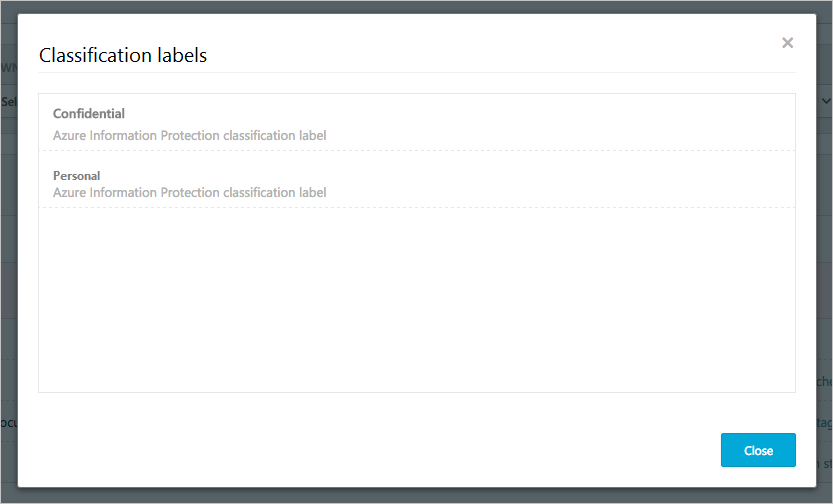

# Azure Information Protection 통합

Cloud App Security를 사용하면 파일을 조사하고 Azure Information Protection 분류 레이블을 기반으로 정책을 설정하여 클라우드에 있는 중요한 데이터를 더 잘 파악하고 제어할 수 있습니다. Azure Information Protection을 Cloud App Security와 통합하는 작업은 확인란 하나를 선택하는 것만큼 쉽습니다. 

Azure Information Protection을 Cloud App Security에 통합하여 다음과 같이 클라우드에서 서비스와 안전한 파일의 전체 성능을 모두 활용할 수 있습니다.
- 중앙 위치에서 분류된 모든 파일을 보는 기능
- 분류 수준에 따라 조사를 수행하고 클라우드 응용 프로그램을 통해 중요한 데이터의 노출을 수량화하는 기능
- 분류된 파일이 적절하게 처리되도록 하는 정책을 만드는 기능

> [!NOTE] 
> 이 기능을 사용하도록 설정하려면 Cloud App Security 라이선스와 Azure Information Protection Premium P1 또는 P2 라이선스가 모두 필요합니다. 두 라이선스가 모두 있으면 Cloud App Security는 즉시 Azure Information Protection 서비스에서 조직 레이블을 동기화합니다.
> Cloud App Security는 Azure Information Protection 범위 지정 정책을 지원하지 않습니다.

## 작동 방식
사용자는 [Azure Information Protection](https://docs.microsoft.com/information-protection/)의 파일 분류 레이블에 익숙할 것입니다. Cloud App Security에서 Azure Information Protection 분류 태그를 볼 수 있습니다. Cloud App Security를 Azure Information Protection과 통합하는 즉시 Cloud App Security는 다음과 같이 파일을 검색합니다.
1. Cloud App Security는 테넌트에서 사용되는 모든 분류 레이블의 목록을 검색합니다. 이 작업은 목록을 최신 상태로 유지하기 위해 매시간 수행됩니다.
2. 그런 다음 Cloud App Security는 다음과 같이 분류 레이블에 대해 파일을 검색합니다. a. 자동 검색(다음 참조)을 사용하도록 설정한 경우 모든 새 파일이나 수정된 파일이 검색 큐에 추가됩니다.
    b. 분류 레이블을 검색하도록 파일 정책(다음 참조)을 설정한 경우 이러한 파일이 분류 레이블에 대한 검색 큐에 추가됩니다.
3. 위에서 언급했듯이 이러한 검색은 Cloud App Security가 테넌트에서 사용되는 분류 레이블을 확인하기 위해 수행하는 초기 검색에서 발견된 분류 레이블에 대한 것입니다. 테넌트 외부에 있는 사람이 설정한 분류 레이블인 외부 레이블이 분류 레이블 목록에 추가됩니다. 이러한 항목에 대해 검색하지 않으려면 **Only scan files for Azure Information Protection classification labels from this tenant**(이 테넌트의 Azure Information Protection 분류 레이블에 대한 파일만 검색) 확인란(다음 참조)을 선택합니다.
4. Cloud App Security에 대해 Azure Information Protection을 사용하도록 설정하고 나면 Office 365에 추가되는 모든 새 파일도 분류 레이블에 대해 검색됩니다.

## Cloud App Security와 Azure Information Protection을 통합하는 방법
  
### Azure Information Protection 사용

Cloud App Security와 Azure Information Protection을 통합하려면 자동 검색을 사용하도록 설정하여, 정책을 만들 필요 없이 Office 365 파일에 대해 Azure Information Protection 분류 레이블 검색을 사용하도록 설정하기만 하면 됩니다. 이 기능을 사용하도록 설정한 후, 클라우드 환경에 Azure Information Protection 분류 레이블로 레이블이 지정된 파일이 있는 경우 해당 파일이 Cloud App Security에 표시됩니다.

Cloud App Security를 사용하도록 설정하여 분류 레이블에 대해 사용하도록 설정된 콘텐츠 검사로 파일을 검색하려면:

1. Cloud App Security의 설정 코그에서 **일반 설정** 페이지를 선택합니다.
2. Azure Information Protection에서 **파일에서 자동으로 Azure Information Protection 분류 레이블 검색**을 선택합니다. 

Azure Information Protection을 사용하도록 설정하고 나면 Cloud App Security에서 분류 레이블이 있는 파일을 보고 레이블에 따라 필터링할 수 있습니다.

 

> [!NOTE] 
> 자동 검색에서는 다시 수정되지 않는 한 기존 파일을 검색하지 않습니다. Azure Information Protection 분류 레이블에 대한 기존 파일을 검색하려면 **콘텐츠 검사 파일 정책**이 하나 이상 있어야 합니다. 한 개도 없으면, 새 **파일 정책**을 만들고, 미리 설정된 필터를 모두 삭제한 후 **콘텐츠 검사** 옵션을 선택합니다. 그런 다음 **콘텐츠 검사** 아래의 **미리 설정된 식과 일치하는 파일 포함하기**를 클릭한 후 미리 정의된 값을 선택하고 정책을 저장합니다. 이렇게 하면 Azure Information Protection 분류 레이블을 자동으로 감지하는 콘텐츠 검사를 할 수 있습니다.

### 내부 및 외부 태그 설정
기본적으로 Cloud App Security에서는 조직에 정의된 분류 레이블과 다른 조직에서 정의된 외부 레이블을 검색합니다. 

Cloud App Security 포털에서 조직에 대해 외부로 설정된 분류 레이블을 무시하려면 **Azure 보안 설정** 아래의 **일반 설정**에서 **다른 테넌트의 Azure Information Protection 분류 레이블 무시**를 선택합니다.
 

### 파일 노출 제어
- Azure Information Protection 분류 레이블로 레이블이 지정된 문서인 경우:

- Cloud App Security의 **파일** 페이지에서 분류 레이블에 대해 필터링하여 이 파일을 볼 수 있습니다.

- 파일 서랍에서 해당 파일 및 해당 파일의 분류 레이블에 대한 자세한 정보를 얻을 수 있습니다.

- **파일** 페이지에서 관련 파일을 클릭하여 분류 레이블이 있는지 확인합니다.

- 분류 레이블을 클릭하여 자세한 정보를 보거나 분류 레이블의 전체 목록을 확인할 수 있습니다.
 

- 그런 다음 Cloud App Security에서 파일 정책을 만들어 부적절하게 공유된 파일을 제어하고 레이블이 지정되어 최근에 수정된 파일을 찾을 수 있습니다.
- 또한 기밀 파일에 관한 활동에 대한 경고를 트리거할 수도 있습니다.

> [!Note]
> 파일에 대해 Azure ID 보호 레이블을 사용하지 않도록 설정하면 사용하지 않도록 설정한 레이블이 Cloud App Security에서 사용 안 함으로 표시됩니다. 삭제된 레이블은 표시되지 않습니다.

**정책 1 - 상자에서 외부 공유된 기밀 데이터:**

1.  파일 정책을 만듭니다.
2.  정책의 이름, 심각도 및 범주를 설정합니다.
3.  다음 필터를 추가하여 상자에서 외부 공유된 모든 기밀 데이터 찾기:

 

**정책 2 - 최근에 SharePoint의 Finance 폴더 외부에서 수정된 제한된 데이터:**

1.  파일 정책을 만듭니다.
2.  정책의 이름, 심각도 및 범주를 설정합니다.
3.  다음 필터를 추가하여 최근에 수정된 모든 제한 데이터를 찾고 폴더 선택 옵션에 [Finance 폴더 제외] 추가: 
 
 

경고를 설정하거나, 사용자에게 알리거나, 이러한 정책에 즉각적인 조치를 취할 수도 있습니다.
[거버넌스 작업](governance-actions.md)에 대해 자세히 알아보세요.

[Azure Information Protection](https://docs.microsoft.com/en-us/information-protection/understand-explore/what-is-information-protection)에 대해 자세히 알아보고 Azure Information Protection [빠른 시작 자습서](https://docs.microsoft.com/en-us/information-protection/get-started/infoprotect-quick-start-tutorial)를 확인하세요.

## Azure 권한 관리와 통합

조직에는 Cloud App Security와 Azure RMS 간에 통합할 수 있도록 사용이 허가되고 활성화된 Azure 권한 관리가 있어야 합니다.  이러한 두 가지 별도의 단계는 [Azure 권한 관리 활성화](https://docs.microsoft.com/information-protection/deploy-use/activate-service)에서 찾아볼 수 있습니다.

Cloud App Security는 현재 Office 파일(2016 이상)을 위한 네이티브 보호를 지원합니다. PDF 및 이미지 파일은 이후 버전에서 사용할 수 있습니다. 

이 기능은 현재 SharePoint Online 및 비즈니스용 OneDrive에 저장된 파일에서 사용할 수 있습니다. 향후 버전에서는 더 많은 클라우드 앱이 지원됩니다.

Cloud App Security가 Office 365 서비스에 연결되면 Cloud App Security RMS 통합 기능을 사용할 수 있게 됩니다. 그러면 다음과 같이 Cloud App Security 포털에서 직접 RMS를 통해 문서를 보호할 수 있습니다.

1. **파일** 페이지에서, 보호하려는 파일을 선택한 후 파일의 행 끝부분에 있는 점 세 개를 클릭하고 **보호**를 선택합니다. 

>[!NOTE]
>Azure Information Protection은 최대 50MB 크기의 파일을 보호합니다. 

2. 파일을 보호하는 데 사용할 조직의 분류 레이블 중 하나를 선택하라는 메시지가 표시되면 **보호**를 클릭합니다. 

3. 분류 레이블을 선택하고 보호를 클릭하면 Cloud App Security가 분류 레이블을 적용하고 원본 파일을 보호합니다. T
> [!NOTE]
>   파일에 전사적 RMS 분류 레이블을 적용하는 것이 좋습니다. 그러면 파일의 원래 소유자를 비롯하여 조직의 모든 사용자가 이러한 파일에 액세스할 수 있게 됩니다. 파일이 보호되면 파일의 소유자, 파일의 공유 정책 및 파일에 이미 액세스할 수 있는 사용자 목록이 변경되지 않습니다.

4. 사용자가 보호된 파일에 액세스하려는 경우 장치에 RMS 공유 앱이 설치되어 있어야 합니다. 자세한 내용은 [Microsoft Rights Management 공유 응용 프로그램 기술 개요 및 보호 세부 정보](https://docs.microsoft.com/information-protection/rms-client/sharing-app-admin-guide-technical)를 참조하세요.

5. **거버넌스 로그**에서 이전에 수행한 보호 작업의 행 끝부분에 있는 **되돌리기** 단추를 클릭하여 언제든지 이 작업을 되돌릴 수 있습니다. 

Cloud App Security와 Azure Information Protection이 함께 작동하는 방식에 관한 자세한 내용은 [사용자 실수로부터 데이터 보호](https://docs.microsoft.com/enterprise-mobility-security/solutions/protect-data-user-mistake)를 참조하세요.

 
## 관련 동영상  
[Cloud App Security + Azure Information Protection 통합](https://channel9.msdn.com/Shows/Microsoft-Security/MCAS--AIP-Integrations)  

## 참고 항목  
[정책을 사용하여 클라우드 앱 제어](control-cloud-apps-with-policies.md)   
[기술 지원을 받으려면 Cloud App Security 보조 지원 페이지를 방문하세요.](http://support.microsoft.com/oas/default.aspx?prid=16031)   
[프리미어 고객은 프리미어 포털에서 직접 Cloud App Security를 선택할 수도 있습니다.](https://premier.microsoft.com/)  
  
