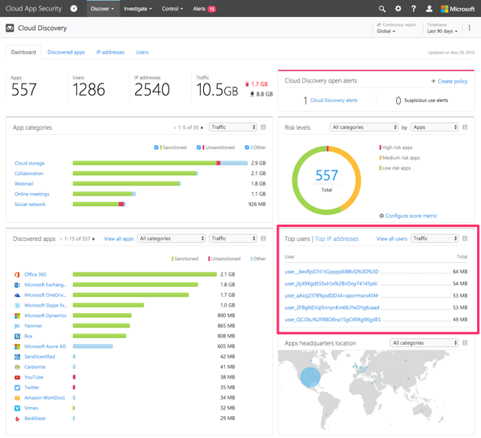

# Cloud Discovery 데이터 익명화

Cloud Discovery 데이터 익명화를 사용하면 사용자 개인 정보를 보호할 수 있습니다. Cloud App Security 포털에 데이터 로그를 업로드하면 로그가 삭제되고 모든 사용자 이름 정보가 암호화된 사용자 이름으로 교체됩니다. 이러한 방식으로 모든 클라우드 활동이 익명으로 유지됩니다. 특정 보안 조사를 위해(예: 보안 위반 또는 의심스런 사용자 활동) 필요한 경우 관리자는 실제 사용자 이름을 확인할 수 있습니다. 관리자는 특정 사용자를 의심할 만한 이유가 있는 경우 알려진 사용자 이름의 암호화된 사용자 이름을 조회한 다음 암호화된 사용자 이름을 사용하여 조사를 시작할 수도 있습니다. 각 사용자 이름 변환에 대한 감사는 포털의 **거버넌스 로그**에서 수행됩니다.

핵심 사항:
-   개인 정보는 저장되거나 표시되지 않습니다. 암호화된 정보만 표시됩니다.
-   비공개 데이터는 테넌트당 전용 키와 함께 AES-128을 사용하여 암호화됩니다.
-   사용자 이름 확인은 암호화된 특정 이름을 해독하여 임시로, 사용자 단위로 수행됩니다.

데이터 익명화 작동 방식:

1.  데이터 익명화를 적용하는 방법에는 세 가지가 있습니다. 
    
    - [새 스냅숏 보고서를 만들고](create-snapshot-cloud-discovery-reports.md) **Anonymize private information**(개인 정보 익명화)을 선택하여 특정 로그 파일의 데이터를 익명화하도록 설정할 수 있습니다.

      

    - 새 데이터 원본을 추가할 때 **Anonymize private information**(개인 정보 익명화)를 선택하여 [새 데이터 원본에 대한 자동 업로드](configure-automatic-log-upload-for-continuous-reports.md)의 데이터를 익명화하도록 설정할 수 있습니다.  
  
      

    - 업로드된 로그 파일의 스냅숏 보고서 및 로그 수집기의 연속 보고서에서 오는 모든 데이터를 익명화하려면 Cloud App Security에서 다음과 같이 기본값을 설정할 수 있습니다.
     
        1. Settings(설정) 코그 아래에서 **Cloud Discovery settings**(Cloud Discovery 설정)를 선택합니다.
     
        2. 기본적으로 사용자 이름을 익명화하려면 Anonymization(익명화) 탭에서 **Anonymize private information by default in new reports and data sources**(기본적으로 새 보고서 및 데이터 원본의 개인 정보 익명화)를 선택합니다.

        3. [암호화 키]에서 **Use the dedicated key generated for your portal**(포털에 대해 생성된 전용 키 사용) 또는 **Use a custom key**(사용자 지정 키 사용)를 선택합니다. **Use a custom key**(사용자 지정 키 사용)를 선택한 경우 16바이트 UTF8 암호화 키를 입력합니다.
        4. **Save**을 클릭합니다.
 
       
  

2.  익명화를 선택하면 Cloud App Security는 트래픽 로그를 구문 분석하고 특정 데이터 특성을 추출합니다.
3.  Cloud App Security는 사용자 이름을 암호화된 사용자 이름으로 교체합니다.
4.  그런 다음 클라우드 사용량 데이터를 분석하고 익명화된 데이터를 기반으로 Cloud Discovery 보고서를 생성합니다.
 
    
 
5.  비정상적인 사용량 경고 조사와 같은 특정 조사의 경우 포털에서 특정 사용자 이름을 확인하고 비즈니스 근거를 제공할 수 있습니다. 이 페이지는 알려진 사용자 이름의 암호화된 사용자 이름을 조회하는 데에도 사용할 수 있습니다. 

    1. Settings(설정) 코그 아래에서 **Cloud Discovery settings**(Cloud Discovery 설정)를 선택합니다.
    2. **Anonymize and resolve usernames**(사용자 이름 익명화 및 확인) 아래의 **Anonymization**(익명화) 탭에서 확인을 수행하는 근거를 입력합니다.
    3. **Enter username to resolve**(확인할 사용자 이름 입력) 아래에서 **From anonymized**(익명화된 항목에서)를 선택하고 익명화된 사용자 이름을 입력하거나, **To anonymized**(익명화된 항목으로)를 선택하고 확인할 원래 사용자 이름을 입력합니다. **Resolve**(확인)를 클릭합니다. 

   

6.  포털의 **거버넌스 로그**에서 작업 감사가 수행됩니다. 

     

  
      
## 참고 항목  
[정책을 사용하여 클라우드 앱 제어](control-cloud-apps-with-policies.md)   
[기술 지원을 받으려면 Cloud App Security 보조 지원 페이지를 방문하세요.](http://support.microsoft.com/oas/default.aspx?prid=16031)   
[프리미어 고객은 프리미어 포털에서 직접 Cloud App Security를 선택할 수도 있습니다.](https://premier.microsoft.com/)  
    
      
  
