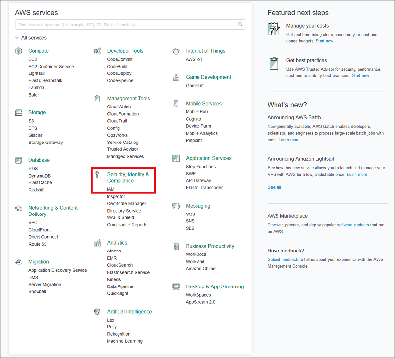
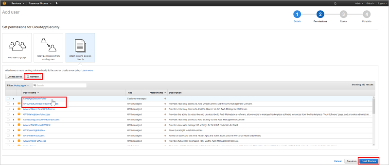
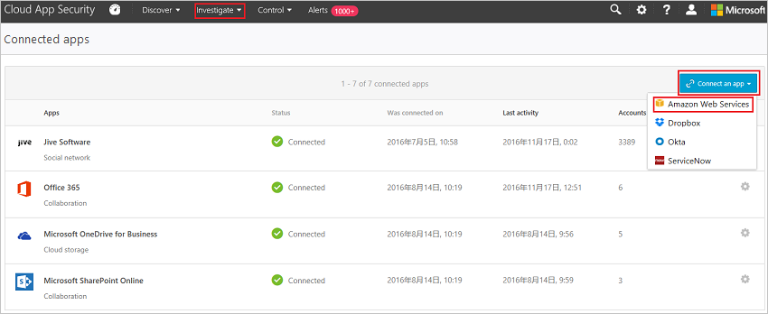

# <a name="connect-aws-to-microsoft-cloud-app-security"></a>Microsoft Cloud App Security에 AWS 연결

*적용 대상: Microsoft Cloud App Security*

이 문서에서는 커넥터 API를 사용하여 기존 Amazon Web Services 계정에 Microsoft Cloud App Security를 연결하기 위한 지침을 제공합니다. 이 연결은 AWS 앱 사용에 대한 표시 유형과 제어를 제공합니다. 
  
## <a name="how-to-connect-amazon-web-services-to-cloud-app-security"></a>Cloud App Security에 Amazon 웹 서비스 비교를 연결하는 방법  
  
1.  [Amazon Web Services 콘솔](https://console.aws.amazon.com/)의 **Security, Identity & Compliance**(보안, ID 및 규정 준수)에서 **IAM**을 클릭합니다.  
  
       
  
2.  **Users**(사용자) 탭을 클릭한 다음 **Add user**(사용자 추가)를 클릭합니다.  
  
           
  
4.  **Details**(세부 정보) 단계에서 Cloud App Security에 대한 새 사용자 이름을 제공합니다. **Access type**(액세스 유형)에서 **Programmatic access**(프로그래밍 방식 액세스)를 선택한 후 **Next Permissions**(다음 권한)를 클릭해야 합니다.  

     

5. JSON 탭을 클릭합니다.

     

6. 다음 스크립트를 제공된 영역에 붙여넣습니다.

    ```     
    {  
      "Version" : "2012-10-17",  
      "Statement" : [{  
          "Action" : [  
            "cloudtrail:DescribeTrails",  
            "cloudtrail:LookupEvents",  
            "cloudtrail:GetTrailStatus",  
            "cloudwatch:Describe*",  
            "cloudwatch:Get*",  
            "cloudwatch:List*",  
            "iam:List*",  
            "iam:Get*",
            "s3:ListAllMyBuckets",
            "s3:PutBucketAcl",
            "s3:GetBucketAcl",
            "s3:GetBucketLocation"
          ],  
          "Effect" : "Allow",  
          "Resource" : "*"  
        }  
      ]  
     }  
  
    ```  

     
    
6. **정책 검토**를 클릭합니다.

7. **이름**을 제공하고 **정책 만들기**를 클릭합니다.

     

9. **Add user**(사용자 추가) 화면으로 돌아가서 필요한 경우 목록을 새로 고치고 직접 만든 사용자를 선택한 후 **Next Review**(다음 검토)를 클릭합니다.

   

10. 모든 세부 정보가 올바른 경우 **Create user**(사용자 만들기)를 클릭합니다.

    

11. 성공 메시지가 표시되면 **Download .csv**를 클릭하여 새 사용자의 자격 증명 복사본을 저장합니다. 나중에 필요합니다.  

    
  
10. AWS 콘솔에서 **Services**(서비스)를 클릭하고 **Management Tools**(관리 도구) 아래의 **CloudTrail**을 클릭합니다.  
  
       
  
    이전에 CloudTrail을 사용하지 않은 경우 **Get Started**(시작)를 클릭하고, 이름을 제공하고, 적절한 S3 버킷을 선택하여 설정하고, **Turn On**(켜기)을 클릭합니다. 전체 범위를 적용하려면 **Apply to all regions**(모든 지역에 적용)를 **Yes**(예)로 설정합니다.
  
       
  
    **Trails**(내역) 목록에 새 CloudTrail 이름이 표시됩니다.
    
      
  
11. Cloud App Security 포털에서 **조사**, **연결된 앱**을 차례로 클릭합니다.  
  
12. **앱 커넥터** 페이지에서 더하기 기호 다음에 **Amazon Web Services**를 클릭합니다.  
  
       
  
13. 팝업에서 csv 파일의 **액세스 키** 및 **비밀 키**를 관련 필드에 붙여넣고 **연결**을 클릭합니다.  
    
  
14. **API 테스트**를 클릭하여 연결에 성공했는지 확인합니다.  
  
     테스트는 몇 분 정도 걸릴 수 있습니다. 완료되면 성공 또는 실패 알림을 받게 됩니다. 성공 알림을 받은 후 **완료**를 클릭합니다.  
  
AWS를 연결한 후 연결 전 7일에 대한 이벤트를 받게 됩니다. CloudTrail을 사용하도록 설정한 경우 CloudTrail를 사용하도록 설정한 시점부터 이벤트를 받습니다.
  
## <a name="next-steps"></a>다음 단계  
[정책을 사용하여 클라우드 앱 제어](control-cloud-apps-with-policies.md)   

[프리미어 고객은 프리미어 포털에서 직접 새 지원 요청을 만들 수도 있습니다.](https://premier.microsoft.com/)  
  
  
