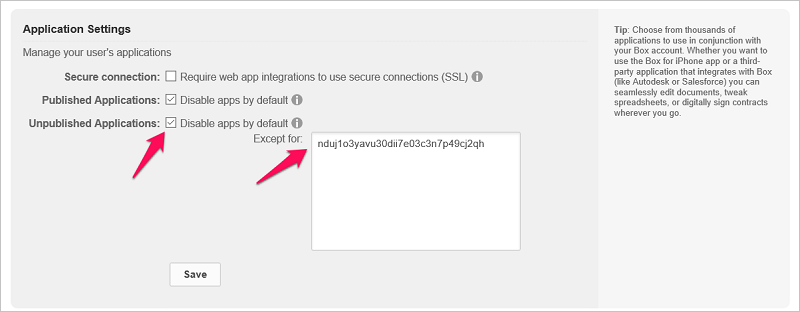

# Microsoft Cloud App Security에 Box 연결

*적용 대상: Microsoft Cloud App Security*

이 문서에서는 앱 커넥터 API를 사용하여 기존 Box 계정에 Microsoft Cloud App Security를 연결하기 위한 지침을 제공합니다. 이 연결은 Box 사용에 대한 표시 유형과 제어를 제공합니다.
  
## Cloud App Security에 Box를 연결하는 방법  
  
> [!NOTE]  
>  관리자 계정이 아닌 계정으로 배포하면 API 테스트가 실패하며 Cloud App Security에서 Box의 일부 파일을 검색할 수 없습니다. 이것이 문제가 되는 경우 모든 권한이 선택된 공동 관리자를 사용하여 배포할 수 있지만 API 테스트가 계속 실패하며 Box에서 다른 관리자가 소유한 파일은 검색되지 않습니다.  
  
1.  애플리케이션 권한 액세스를 제한하는 경우 이 단계를 따르세요. 그렇지 않을 경우 2단계로 건너뜁니다.  
  
    -   Box 관리 콘솔에서 설정 아이콘을 클릭한 다음 **비즈니스 설정** 또는 **엔터프라이즈 설정**을 클릭합니다.  
  
           
  
    -   **앱** 탭을 클릭합니다.  
  
           
  
    -   **Unpublished Applications**(게시되지 않은 애플리케이션)이 선택된 경우 **Except for**(제외) 텍스트 상자에서 Cloud App Security 앱 일련 번호를 추가합니다.
     
         |데이터 센터|Microsoft Cloud App Security 일련 번호|
         |----|----|    
         |US1| `nduj1o3yavu30dii7e03c3n7p49cj2qh`|
         |US2|`w0ouf1apiii9z8o0r6kpr4nu1pvyec75`|
         |US3|`dmcyvu1s9284i2u6gw9r2kb0hhve4a0r`|
         |EU1|`me9cm6n7kr4mfz135yt0ab9f5k4ze8qp`|
         |EU2|`uwdy5r40t7jprdlzo85v8suw1l4cdsbf`|

        그런 다음 **저장**을 클릭합니다. 연결된 Cloud App Security 데이터 센터를 확인하는 방법에 대한 자세한 내용은 [API 토큰](api-tokens.md)을 참조하세요. 
  
           
  
    > [!NOTE]  
    >  기존 Adallom 고객이고 콘솔 URL이 Cloud App Security가 아닌 Adallom에 연결된 경우 앱 일련 번호 bwahmilhdlpbqy2ongkl119o3lrkoshc를 사용합니다.  
  
2.  Cloud App Security 포털에서 **조사**, **연결된 앱**을 차례로 클릭합니다.  
  
3.  **앱 커넥터** 페이지에서 더하기 기호 단추, **Box**를 차례로 클릭합니다.  
  
       
  
4.  **Box 설정** 팝업에서 **이 링크를 따름**을 클릭합니다.  
  
5.  Box 로그인 페이지가 열립니다. Cloud App Security에서 팀의 Box 앱에 액세스할 수 있도록 자격 증명을 입력합니다.  
  
6.  Box에서 팀 정보 및 활동 로그에 대한 Cloud App Security의 액세스와 팀 멤버로서의 작업 수행을 허용할지 여부를 묻는 메시지를 표시합니다. 계속하려면 **허용**을 클릭합니다.  
  
7.  Cloud App Security 포털로 돌아가면 Box가 연결되었다는 메시지가 표시됩니다.  
  
8.  **API 테스트**를 클릭하여 연결에 성공했는지 확인합니다.  
  
     테스트는 몇 분 정도 걸릴 수 있습니다. 성공 알림을 받은 후 **닫기**를 클릭합니다.  
  
이제 Box가 Cloud App Security에 연결되었습니다.  
 
Box를 연결한 후 연결 전 60일에 대한 이벤트를 받게 됩니다.
  
Box를 연결한 후 Cloud App Security에서 전체 검색을 수행합니다. 파일 및 사용자 수에 따라 전체 검색을 완료하려면 시간이 오래 걸릴 수 있습니다. 근 실시간 검색을 사용하려면 작업이 감지되는 파일을 검색 큐의 시작 부분으로 이동합니다. 예를 들어 편집, 업데이트 또는 공유되는 파일은 정기적인 검색 프로세스에 연결될 때까지 대기하지 않고 바로 검색합니다. 기본적으로 수정되지 않는 파일에는 거의 실시간 검색이 적용되지 않습니다. 예를 들어 보거나, 미리 보거나, 인쇄하거나, 내보내는 파일은 정기적으로 예약된 검색의 일부로 검색됩니다.
  
## 다음 단계 
[정책을 사용하여 클라우드 앱 제어](control-cloud-apps-with-policies.md)   

[프리미어 고객은 프리미어 포털에서 직접 새 지원 요청을 만들 수도 있습니다.](https://premier.microsoft.com/)  
  
  
