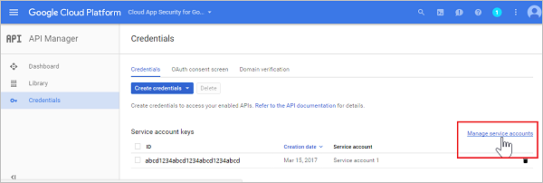

# Microsoft Cloud App Security에 G Suite 연결
이 섹션에서는 커넥터 API를 사용하여 기존 G Suite 계정에 Cloud App Security를 연결하기 위한 지침을 제공합니다.

  
  
## G Suite 구성  
  
1.  G Suite 슈퍼 관리자로 [https://cloud.google.com/console/project](https://cloud.google.com/console/project)에 로그인합니다.  
  
2.  **Create project**(프로젝트 만들기)를 클릭하여 새 프로젝트를 시작합니다.  
  
       
  
3.  **새 프로젝트** 화면에 
    **Microsoft Cloud App Security**로 프로젝트 이름을 지정하고 **만들기**를 클릭합니다.  
             
  
4.  프로젝트를 만든 후 도구 모음에서 Google Cloud Platform 옆에서 프로젝트를 선택하고 **API** 아래에서 **Go to APIs overview**(API 개요로 이동)를 클릭합니다.  
  
       
  
5.  **API** 아래에서 나열된 API를 모두 사용하지 않도록 설정합니다.  
      
6.  **Library**(라이브러리)를 클릭하고 다음 API를 사용하도록 설정합니다(API가 **Popular APIs**(인기 API) 목록에 표시되지 않는 경우 검색 줄 사용).  
  
       
  
    > [!NOTE]  
    >  지금은 **자격 증명** 경고를 무시합니다.  
  
    -   관리자 SDK  
  
    -   감사 API  
  
    -   Google 드라이브 API  
  
    -   Google Apps Marketplace SDK  
  
    -   Gmail API  
            
7.  **사용 API**가 5개 있어야 합니다.  
  
       
  
8.  **자격 증명**, **OAuth 승인 화면**을 차례로 클릭합니다.  
  
    -   **사용자에게 표시되는 제품 이름**에서 **Microsoft Cloud App Security**를 입력합니다.  
  
    -   다른 모든 필드는 선택 사항입니다.  
  
    -   **Save**을 클릭합니다.  
  
       
  
9. **API Credentials**(API 자격 증명) 화면에서 **Create credentials**(자격 증명 만들기) 옆의 화살표를 클릭합니다.  
  
       

10. **Service account key**(서비스 계정 키)를 선택합니다.

       
  
11. **Create service account key**(서비스 계정 키 만들기)에서 **New service account**(새 서비스 계정)를 선택하고 이름(예:**Service account 1**)을 입력한 다음 **Role**(역할)에서 **Project**(프로젝트)와 **Editor**(편집자)를 선택한 다음 **Key type**(키 유형)에서 **P12**를 선택하고 **Create**(만들기)를 클릭합니다. **Enable G Suite Domain-wide Delegation**(G Suite 도메인 수준 위임 사용) 확인란을 선택하고 **저장**을 클릭합니다.  
  
       
  
12.  P12 인증서 파일이 컴퓨터에 저장됩니다.  
        
12. **자격 증명** 화면에서 맨 오른쪽에 있는 **서비스 계정 관리**를 클릭합니다.  
         
  
13. 만든 서비스 계정의 오른쪽에 있는 3개의 점을 클릭하고 **편집**을 선택합니다.  
  
       
  
15. 나중에 필요하므로 서비스에 할당된 **Service account ID**(서비스 계정 ID)를 복사합니다.  
  
       
  
16. 제목 표시줄의 Google Cloud Platform 옆에 있는 세 개의 가로선을 클릭하여 Google 메뉴를 열고 **API 관리자**와 **대시보드**를 선택합니다.  
    
17. 사용 가능한 API 목록으로 아래로 스크롤하고 **Google Drive API**(Google 드라이브 API) 옆의 설정을 클릭합니다.   
         

18. 다음을 입력합니다.

    -   **응용 프로그램 이름**: Microsoft Cloud App Security.  
  
    -   **짧은 설명 및 자세한 설명**(선택 사항): Microsoft Cloud App Security를 통해 클라우드 응용 프로그램을 파악할 수 있으며 클라우드 응용 프로그램 사용을 제어, 조사 및 규제하고, 회사 데이터를 보호하고, 임의 클라우드 응용 프로그램에 대한 의심스러운 활동을 검색하는 데 도움이 됩니다.  
  
    -   Google을 사용하려면 하나 이상의 응용 프로그램 아이콘을 업로드해야 합니다. [https://portal.cloudappsecurity.com/cas/static/files/MSLogos.zip](https://portal.cloudappsecurity.com/cas/static/files/MSLogos.zip)으로 이동하여 Cloud App Security 아이콘이 포함된 zip 파일을 다운로드합니다. 그런 다음 **응용 프로그램 아이콘**에서 128x128 및 32x32 이미지를 끌어서 놓습니다.  
  
    -   **Drive Integration**(드라이브 통합)에서 **Open URL:**(URL 열기:) 아래에 다음을 입력합니다.  
  
         https://portal.cloudappsecurity.com/#/services/11770?tab=files  
     
           
  
19. **사용 API** 목록에서 **Google Apps Marketplace SDK** 옆에 있는 설정 코그 설정을 클릭합니다. 
           
20. **구성** 탭을 선택합니다. 
  
    -   나중에 사용하기 위해 맨 위에 표시되는 **프로젝트 번호(앱 ID)**를 복사합니다.  
  
    -   **응용 프로그램 이름**은 **Microsoft Cloud App Security**로 표시되어야 합니다.
  
         **응용 프로그램 설명** 필드에 "Microsoft Cloud App Security를 통해 클라우드 앱을 파악할 수 있으며 클라우드 앱 사용을 제어, 조사 및 규제하고, 회사 데이터를 보호하고, 임의 클라우드 앱에 대한 의심스러운 활동을 검색하는 데 도움이 됩니다."라고 입력합니다.  
  
    -   **개별 설치 사용** 확인란을 선택 취소합니다.  
  
    -   **응용 프로그램 아이콘**에서 필수 이미지 4개를 구성합니다.  
  
         이미지는 다음 위치에서 확인할 수 있습니다. [https://portal.cloudappsecurity.com/cas/static/files/MSLogos.zip](https://portal.cloudappsecurity.com/cas/static/files/MSLogos.zip)  
  
           
  
    -   다음 **지원 URL**을 입력합니다.  
  
        -   **서비스 약관 URL**: http://go.microsoft.com/fwlink/?LinkID=733268  
  
        -   **개인 정보 취급 방침 URL**: http://go.microsoft.com/fwlink/?LinkId=512132  
  
    -   **OAuth 2.0 scopes**(OAuth 2.0 범위)에서 다음을 복사하고 붙여넣습니다. 한 번에 하나씩 복사한 후 <Enter> 키를 눌러야 합니다.  
  
           https://www.googleapis.com/auth/admin.reports.audit.readonly  
  
           https://www.googleapis.com/auth/admin.reports.usage.readonly  
  
           https://www.googleapis.com/auth/drive  
  
           https://www.googleapis.com/auth/drive.appdata  
  
           https://www.googleapis.com/auth/drive.apps.readonly  
  
           https://www.googleapis.com/auth/drive.file  
  
           https://www.googleapis.com/auth/drive.metadata.readonly  
  
           https://www.googleapis.com/auth/drive.readonly  
  
           https://www.googleapis.com/auth/drive.scripts  
  
           https://www.googleapis.com/auth/admin.directory.user.readonly  
  
           https://www.googleapis.com/auth/admin.directory.user.security  
  
           https://www.googleapis.com/auth/admin.directory.user.alias  
  
           https://www.googleapis.com/auth/admin.directory.orgunit  
  
           https://www.googleapis.com/auth/admin.directory.notifications  
  
           https://www.googleapis.com/auth/admin.directory.group.member  
  
           https://www.googleapis.com/auth/admin.directory.group  
  
           https://www.googleapis.com/auth/admin.directory.device.mobile.action  
  
           https://www.googleapis.com/auth/admin.directory.device.mobile  
  
           https://www.googleapis.com/auth/admin.directory.user  
  
    -   **변경 내용 저장**을 클릭합니다.  
  
18. [admin.google.com](https://admin.google.com/)으로 이동하고 **Security**(보안)를 선택합니다. 
         
 
19. **API 참조**를 선택합니다.  
         
      
20. **API 액세스 사용**을 선택하고 **변경 내용 저장**을 클릭합니다.  
  
      

  
## Cloud App Security 구성  
  
1.  Cloud App Security 포털에서 **조사**, **연결된 앱**을 차례로 클릭합니다.  
  
2.  **연결된 앱** 페이지에서 더하기 기호를 클릭하고 **G Suite**를 선택합니다.  
       
  
3.  팝업에서 다음을 입력합니다.  
  
       
  
    1.  16단계에서 복사한 **서비스 계정 메일 주소**  
  
    2.  21단계에서 복사한 **프로젝트 번호(앱 ID)**  
  
    3.  12단계에서 저장한 **인증서** P12를 업로드합니다. 이렇게 하려면 저장한 암호가 필요합니다.  
  
    4.  G Suite 관리자의 **관리자 계정 메일** 하나를 입력합니다.  
  
    5.  G Suite unlimited 계정이 있는 경우 이 확인란을 선택합니다. Cloud App Security for G Suite unlimited에서 사용할 수 있는 기능에 대한 자세한 내용은 [앱에 대해 인스턴트 표시 유형, 보호 및 거버넌스 작업 사용](enable-instant-visibility-protection-and-governance-actions-for-your-apps.md)을 참조하세요.  
  
    6.  **설정 저장**을 클릭합니다.  
  
    7.  **링크를 따라** G Suite에 연결합니다. G Suite가 열리고 Cloud App Security에 대한 액세스 권한을 부여하라는 메시지가 표시됩니다.  
         
    8.  **Test now**(지금 테스트)를 클릭하여 연결에 성공했는지 확인합니다.  
  
         테스트는 몇 분 정도 걸릴 수 있습니다.  
  
         성공 알림을 받은 후 **완료**를 클릭하고 G Suite 페이지를 닫습니다.  
  
  
G Suite를 연결한 후 연결 전 60일 동안 이벤트를 받게 됩니다.
  
G Suite를 연결한 후 Cloud App Security에서 전체 검색을 수행합니다. 파일 및 사용자 수에 따라 전체 검색을 완료하려면 시간이 오래 걸릴 수 있습니다. 근 실시간 검색을 사용하려면 작업이 감지되는 파일을 검색 큐의 시작 부분으로 이동합니다. 예를 들어 편집, 업데이트 또는 공유되는 파일은 바로 검색하며 일반 검색 프로세스에 연결될 때까지 대기하지 않습니다. 단, 보거나, 미리 보거나, 인쇄하거나, 내보내는 파일과 같이 기본적으로 수정되지 않는 파일에는 적용되지 않습니다.
  
  
## 참고 항목  
[정책을 사용하여 클라우드 앱 제어](control-cloud-apps-with-policies.md)   
[기술 지원을 받으려면 Cloud App Security 보조 지원 페이지를 방문하세요.](http://support.microsoft.com/oas/default.aspx?prid=16031)   
[프리미어 고객은 프리미어 포털에서 직접 Cloud App Security를 선택할 수도 있습니다.](https://premier.microsoft.com/)  
  
  