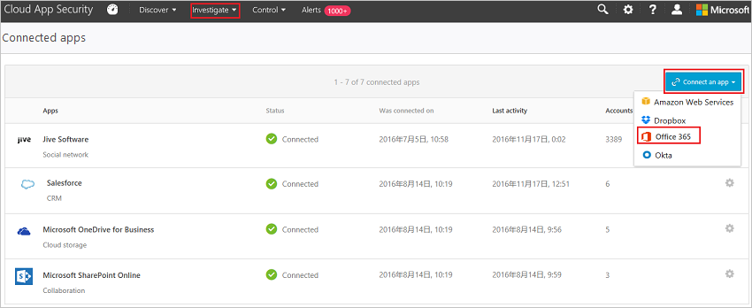

# Microsoft Cloud App Security에 Office 365 연결
이 섹션에서는 앱 커넥터 API를 사용하여 기존 Microsoft Office 365 계정에 Cloud App Security를 연결하기 위한 지침을 제공합니다.  
  
Cloud App Security는 Office 365 서비스의 최신 제공(Office 365의 vNext 릴리스 제품군)뿐만 아니라 레거시 Office 365 전용 플랫폼을 지원합니다.  Cloud App Security는 레거시 Microsoft Business Productivity Online Standard Suite를 지원하지 않습니다. 

> [!NOTE]
> 몇몇 경우에 vNext 서비스 릴리스는 관리 수준이 표준 Office 365 제공과 살짝 다릅니다.

Cloud App Security에서는 다음 Office 365 앱을 지원합니다.

- Office 365
- SharePoint
- OneDrive
- Teams(Teams의 활동이 포털에서 검색된 후에만 나타남)
- Power BI(Power BI의 활동이 포털에서 검색된 후에만 나타나고 감사 기능을 켜야 함)
- Exchange(Exchange의 활동이 포털에서 검색된 후에만 나타나고 감사 기능을 켜야 함)

 
## Cloud App Security에 Office 365를 연결하는 방법  
  
> [!NOTE]
>- Cloud App Security에 Office 365를 연결하려면 Office 365 라이선스가 하나 이상 할당되어 있어야 합니다.
>-  Office 365에서 기본적으로 사용되는 Exchange 관리자 감사 로깅은 관리자(또는 관리자 권한이 할당된 사용자)가 Exchange Online 조직에서 변경 작업을 수행하면 Office 365 감사 로그에 이벤트를 기록합니다. Exchange 관리 센터를 사용하거나 Windows PowerShell에서 cmdlet을 실행하여 수행된 변경 작업이 Exchange 관리자 감사 로그에 기록됩니다. Exchange의 관리자 감사 로깅에 대한 자세한 내용은 [관리자 감사 로깅](http://go.microsoft.com/fwlink/p/?LinkID=619225)을 참조하세요.
>- Exchange Online의 사용자 활동을 기록하기 전에 각 사용자 사서함에 대해 Exchange 사서함 감사 로깅을 켜야 합니다. [Exchange 사서함 활동](https://support.office.com/article/Search-the-audit-log-in-the-Office-365-Security-Compliance-Center-0d4d0f35-390b-4518-800e-0c7ec95e946c)을 참조하세요.
>- Office 앱을 사용하는 경우 Office 365의 일부인 그룹도 특정 Office 앱에서 Cloud App Security로 가져오게 됩니다. 예를 들어 SharePoint를 사용하면 Office 365 그룹이 SharePoint 그룹으로도 가져오게 됩니다.
>- 해당 위치에서 로그를 가져오려면 [Power BI에서 감사를 사용하도록 설정](https://powerbi.microsoft.com/documentation/powerbi-admin-auditing/)해야 합니다. 감사 기능을 사용하도록 설정하면 Cloud App Security에서 로그 가져오기가 시작됩니다(24~72시간 지연 있음).
> Azure Active Directory가 Active Directory 온-프레미스 환경의 사용자와 자동으로 동기화되도록 설정된 경우 온-프레미스 환경의 설정은 Azure AD 설정을 재정의하고, **사용자 일시 중단** 거버넌스 작업의 사용은 되돌려집니다. 
 
1.  **연결된 앱** 페이지에서 더하기 단추를 클릭하고 **Office 365**를 선택합니다.  

2.  Office 365 팝업에서 Office 365 연결을 클릭합니다.

       
 
3.  Office 365에 대한 연결을 테스트하려면 지금 테스트를 클릭합니다. 테스트는 몇 분 정도 걸릴 수 있습니다.
  
     
 
4.   Office 365가 연결된 것으로 표시되면 **닫기**를 클릭합니다.
  
      

> [!NOTE] 
> Office 365를 연결한 후 API를 가져오는, Office 365에 연결된 모든 타사 응용 프로그램을 포함하여 1주일 전부터의 데이터가 표시됩니다. 연결 전에 API를 가져오지 않은 타사 앱의 경우 Cloud App Security에서 기본적으로 꺼져 있는 API를 켜기 때문에 Office 365를 연결하는 순간부터의 이벤트가 표시됩니다.

## 참고 항목  
[정책을 사용하여 클라우드 앱 제어](control-cloud-apps-with-policies.md)   
[기술 지원을 받으려면 Cloud App Security 보조 지원 페이지를 방문하세요.](http://support.microsoft.com/oas/default.aspx?prid=16031)   
[프리미어 고객은 프리미어 포털에서 직접 Cloud App Security를 선택할 수도 있습니다.](https://premier.microsoft.com/)  
  
  