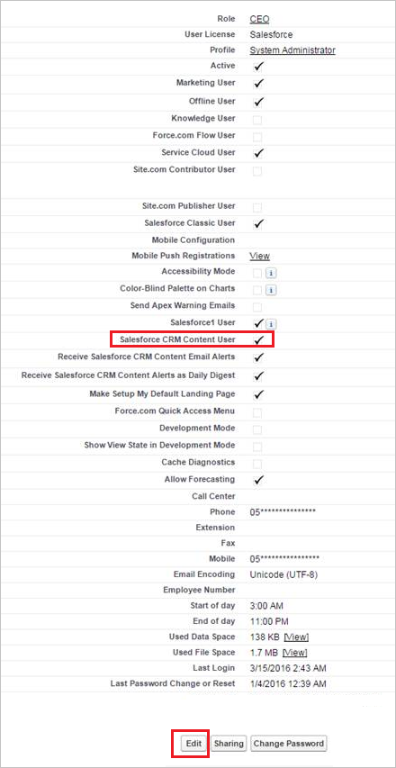

# Microsoft Cloud App Security에 Salesforce 연결
이 섹션에서는 앱 커넥터 API를 사용하여 기존 Salesforce 계정에 Cloud App Security를 연결하기 위한 지침을 제공합니다.  
  
## Cloud App Security에 Salesforce를 연결하는 방법  
  
1.  Cloud App Security에 대한 전용 서비스 관리자 계정을 사용하는 것이 좋습니다.  
  
2.  Salesforce에서 REST API가 사용하도록 설정되었는지 확인합니다.  
  
     Salesforce 계정이 REST API 지원을 포함하는  
  
     **Performance**, **Enterprise**, **Unlimited** 또는 **Developer** 버전 중 하나여야 합니다.  
  
     **Professional** 버전에는 기본적으로 REST API가 없지만 요청 시 추가할 수 있습니다.  
  
     다음과 같이 버전에서 REST API를 사용할 수 있고 사용하도록 설정되었는지 확인합니다.  
  
    -   Salesforce 계정에 로그인한 다음 **설정** 페이지로 이동합니다.  
  
    -   **사용자 관리**에서 **프로필** 페이지로 이동합니다.  
  
           
  
    -   Cloud App Security를 배포하는 데 사용할 프로필을 선택하고 **편집**을 클릭합니다. 이 프로필은 Cloud App Security 서비스 계정에서 앱 커넥터를 설정하는 데 사용됩니다.  
  
           
  
    -   **API 사용** 확인란이 선택되었는지 확인합니다. 선택되지 않은 경우 사용자 계정에 추가하도록 Salesforce에 요청해야 할 수도 있습니다.  
  
           
  
3.  조직에서 **Salesforce CRM 콘텐츠**가 사용으로 설정된 경우 현재 관리자 계정에서도 사용으로 설정되었는지 확인합니다.  
  
    1.  Salesforce 설정 페이지로 이동합니다.  
  
           
  
    2.  측면 메뉴에서 **사용자 관리**를 선택하고 **사용자**를 클릭합니다.  
  
           
  
    3.  현재 관리 사용자를 전용 Cloud App Security 사용자로 선택합니다.  
  
    4.  **Salesforce CRM 콘텐츠 사용자** 확인란이 선택되었는지 확인합니다.  
  
         선택되지 않은 경우 **편집**을 클릭하고 확인란을 선택합니다.  
  
           
  
    5.  **Save**을 클릭합니다.  
  
4.  Cloud App Security 콘솔에서 **조사**, **연결된 앱**을 차례로 클릭합니다.  
  
5.  **앱 커넥터** 페이지에서 더하기 단추, **Salesforce**를 차례로 클릭합니다.  
  
       
  
6.  Salesforce 설정 페이지의 API 탭에서 설치하려는 인스턴스에 따라 **이 링크를 따름**을 클릭합니다.  
  
7.  Salesforce 로그온 페이지가 열립니다. Cloud App Security에서 팀의 Salesforce 앱에 액세스할 수 있도록 자격 증명을 입력합니다.  
  
       
  
8.  Salesforce에서 팀 정보 및 활동 로그에 대한 Cloud App Security의 액세스와 팀 멤버로서의 작업 수행을 허용할지 여부를 묻는 메시지를 표시합니다. 계속하려면 **허용**을 클릭합니다.  
  
9. 이때 배포와 관련된 성공 또는 실패 알림이 표시됩니다. 이제 Salesforce.com에서 Cloud App Security에 권한이 부여되었습니다.  
  
10. Cloud App Security 콘솔로 돌아가면 Salesforce가 연결되었다는 메시지가 표시됩니다.  
  
11. **API 테스트**를 클릭하여 연결에 성공했는지 확인합니다.  
  
     테스트는 몇 분 정도 걸릴 수 있습니다. 성공 알림을 받은 후 **완료**를 클릭합니다.  
  
  
SalesForce를 연결한 후 SalesForce EventMonitoring 라이선스에 따라 연결 순간부터의 트리거, 연결 전 60일 동안의 로그인 이벤트 및 설정 감사 내역, 30일 또는 1일 전 EventMonitoring과 같은 이벤트를 받게 됩니다.
  
## 참고 항목  
[정책을 사용하여 클라우드 앱 제어](control-cloud-apps-with-policies.md)   
[기술 지원을 받으려면 Cloud App Security 보조 지원 페이지를 방문하세요.](http://support.microsoft.com/oas/default.aspx?prid=16031)   
[프리미어 고객은 프리미어 포털에서 직접 Cloud App Security를 선택할 수도 있습니다.](https://premier.microsoft.com/)  
  
  

<!--HONumber=Nov16_HO5-->

