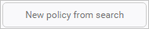

# 정책을 사용하여 클라우드 앱 제어

*적용 대상: Microsoft Cloud App Security*

정책을 사용하면 사용자가 클라우드에서 동작하게 하려는 방식을 정의할 수 있습니다. 이를 통해 클라우드 환경에서 위험한 동작, 위반 또는 의심스러운 데이터 요소 및 활동을 검색할 수 있습니다. 필요한 경우 수정 작업 흐름을 통합하여 완전한 위험 완화를 달성할 수 있습니다. 클라우드 환경에 대해 수집하려는 다양한 정보 유형 및 수행할 수 있는 수정 작업 유형과 상호 관련된 여러 유형의 정책이 있습니다.  
  
예를 들어 격리하려는 데이터 위반 위협이 있는 경우 조직에서 위험한 클라우드 앱을 사용할 수 없도록 차단하는 대신 다른 유형의 정책을 적용해야 합니다.  
  
## 정책 유형  
**정책** 페이지를 볼 때 다양한 정책 및 템플릿을 유형과 아이콘으로 구분하여 사용 가능한 정책을 확인할 수 있습니다. 사용 가능한 정책은 데이터 원본과 조직의 Cloud App Security에서 사용하도록 설정한 항목에 따라 달라집니다. 예를 들어 Cloud Discovery 로그를 업로드한 경우 Cloud Discovery와 관련된 정책이 표시됩니다.

다음 유형의 정책을 만들 수 있습니다.  
  
|정책 유형 아이콘|정책 유형|Windows Server Update Services와 함께|  
|-----|-----------------|---------|  
||액세스 정책|액세스 정책을 통해 클라우드 앱에 대한 사용자 로그인을 실시간으로 모니터링하고 제어할 수 있습니다.|
||활동 정책|활동 정책을 통해 앱 공급자의 API를 사용하여 다양한 자동화된 프로세스를 적용할 수 있습니다. 이러한 정책을 사용하면 다양한 사용자가 수행하는 특정 활동을 모니터링하거나 한 가지 특정 활동 유형의 예기치 않게 높은 비율을 팔로우할 수 있습니다.|  
||변칙 검색 정책|변칙 검색 정책을 사용하면 클라우드에서 비정상적인 활동을 찾을 수 있습니다. 탐지는 조직의 기준 또는 사용자의 정규 활동과 다른 상황이 발생할 때 경고하도록 설정한 위험 요소를 기반으로 합니다.|  
||앱 검색 정책|앱 검색 정책을 통해 조직 내에서 새로운 앱이 검색되면 알려주는 경고를 설정할 수 있습니다.|  
||클라우드 검색 변칙 검색 정책|클라우드 검색 변칙 검색 정책은 클라우드 앱 검색에 사용하는 로그를 확인하고 비정상적인 발생을 검색합니다. 예를 들어 이전에 Dropbox를 사용한 적이 없는 사용자가 갑자가 Dropbox에 600GB를 업로드하거나 특정 앱에서 평소보다 많은 트랜잭션이 있는 경우입니다.|  
||파일 정책|파일 정책을 사용하면 클라우드 앱에서 지정된 파일 또는 파일 형식(공유, 외부 도메인과 공유), 데이터(소유 정보, 개인 데이터, 신용 카드 정보 및 기타 유형의 데이터)를 검색하고 파일에 거버넌스 작업을 적용할 수 있습니다(거버넌스 작업은 클라우드 앱과 관련이 있음).|  
||세션 정책|세션 정책을 통해 클라우드 앱의 사용자 작업을 실시간으로 모니터링하고 제어할 수 있습니다.|

  
## 위험 식별  
Cloud App Security는 클라우드에서 다양한 위험을 완화하는 데 도움이 됩니다. 다음 위험 중 하나와 연결되도록 정책 및 경고를 구성할 수 있습니다.  
  
-   **액세스 제어:** 누가 어디서 무엇에 액세스하나요?  
  
     지속적으로 동작을 모니터링하고 높은 위험의 내부 및 외부 공격을 비롯한 비정상적인 활동을 검색한 다음 경고에 정책을 적용하거나 차단하거나 앱 또는 앱 내의 특정 작업에 대해 ID 확인을 요구합니다. 정교하지 않은 차단 및 세부적인 보기, 편집 및 차단을 통해 사용자, 디바이스 및 지역에 따라 온-프레미스 및 모바일 액세스 제어 정책을 사용하도록 설정합니다. 다단계 인증 실패, 비활성화된 계정 로그인 실패 및 가장 이벤트를 포함하여 의심스러운 로그인 이벤트를 검색합니다.  
  
-   **규정 준수:** 규정 준수 요구 사항이 위반되었나요?  
  
     파일 동기화 서비스에 저장된 각 파일에 대한 공유 권한을 비롯한 중요한 데이터 또는 규제 데이터를 카탈로그로 작성하고 식별하여 PCI, SOX, HIPAA 등의 규정 준수를 보장합니다.  
  
-   **구성 제어:** 구성이 무단으로 변경되고 있나요?  
  
     원격 구성 조작을 비롯한 구성 변경을 모니터링합니다.  
  
-   **클라우드 검색:** 새로운 앱이 조직에서 사용되고 있나요? 모르는 Shadow IT 앱이 사용되는 문제가 있나요?  
  
     규정과 산업 인증 및 모범 사례에 따라 각 클라우드 앱에 대한 전반적인 위험을 평가합니다. 각 클라우드 애플리케이션의 사용자 수, 활동, 트래픽 볼륨 및 일반적인 사용 시간을 모니터링할 수 있습니다.  
  
-   **DLP:** 소유 파일이 공개적으로 공유되고 있나요? 파일을 격리해야 하나요?  
  
     온-프레미스 DLP 통합은 통합 및 폐쇄 루프 수정에 기존 온-프레미스 DLP 솔루션을 제공합니다.  
  
-   **권한 있는 계정:** 관리자 계정을 모니터링해야 하나요?  
  
     권한 있는 사용자 및 관리자의 실시간 활동 모니터링 및 보고입니다.  
  
-   **제어권 공유:** 클라우드 환경에서 데이터가 어떻게 공유되고 있나요?  
  
     파일 콘텐츠와 클라우드 콘텐츠를 검사하고 내부 및 외부 공유 정책을 적용합니다. 공동 작업을 모니터링하고 조직 외부에서 파일이 공유되지 않도록 차단하는 등의 공유 정책을 적용합니다.  
  
-   **위협 탐지:** 클라우드 환경을 위협하는 의심스러운 활동이 있나요?  
  
     문자 메시지 또는 메일을 통해 정책 위반이나 활동 임계값에 대한 실시간 알림을 받습니다. 기계 학습 알고리즘을 적용하여 Cloud App Security를 통해 사용자가 데이터를 오용하고 있음을 나타내는 동작을 검색할 수 있습니다.  
  
## 위험을 제어하는 방법  
정책을 사용하여 위험을 제어하려면 다음 프로세스를 따르세요.  
  
1.  템플릿 또는 쿼리에서 정책을 만듭니다.  
  
2.  예상 결과를 얻기 위해 정책을 미세 조정합니다.  
  
3.  위험에 자동으로 대응하고 수정하기 위해 자동화된 작업을 추가합니다.  
  
### 정책 만들기  
Cloud App Security의 정책 템플릿을 모든 정책에 대한 기준으로 사용하거나 쿼리에서 정책을 만들 수 있습니다.  
  
정책 템플릿은 사용자 환경 내에서 특정 이벤트를 검색하는 데 필요한 구성과 올바른 필터를 설정하는 데 도움이 됩니다. 템플릿에는 모든 유형의 정책이 포함되며, 다양한 서비스에 적용될 수 있습니다.  
  
**정책 템플릿**에서 정책을 만들려면 다음 단계를 수행합니다.  
  
1. 콘솔에서 **제어**, **템플릿**을 차례로 클릭합니다.  
  
      
  
2. 사용하려는 템플릿 행의 오른쪽 끝에 있는 **+** 를 클릭합니다. 사전 정의된 템플릿 구성이 있는 정책 만들기 페이지가 열립니다.  
  
3. 사용자 지정 정책에 필요한 경우 템플릿을 수정합니다. 이 새로운 템플릿 기반 정책의 모든 속성 및 필드를 요구에 따라 수정할 수 있습니다.  
   > [!NOTE] 
   >정책 필터를 사용하는 경우 **포함**은 쉼표, 점, 공백 또는 밑줄로 구분된 전체 단어만 검색합니다. 예를 들어 **malware** 또는 **virus**를 검색하는 경우 virus_malware_file.exe를 찾지만 malwarevirusfile.exe는 찾지 않습니다. *malware.exe*를 검색하는 경우 파일 이름에 malware 또는 exe가 포함된 모든 파일을 찾지만 **"malware.exe"**(따옴표 포함)를 검색하는 경우 정확하게 "malware.exe"가 포함된 파일만 찾습니다. 
    **같음**은 전체 문자열만 검색합니다. 예를 들어 *malware.exe*를 검색하는 경우 malware.exe를 찾지만 malware.exe.txt는 찾지 않습니다.  
4. 새로운 템플릿 기반 정책을 만들면 정책 템플릿 테이블에서 정책을 만든 템플릿 옆에 있는 **연결된 정책** 열에 새 정책에 대한 링크가 나타납니다.   
    각 템플릿에서 원하는 만큼의 정책을 만들 수 있으며 이러한 정책은 모두 원래 템플릿에 연결됩니다. 링크를 통해 동일한 템플릿을 사용하여 빌드된 모든 정책을 추적할 수 있습니다.  
  
또는 **조사하는 동안 정책을 만들** 수 있습니다. **활동 로그**, **파일** 또는 **계정**을 조사 중이며 드릴다운하여 특정 항목을 검색하는 경우 언제든지 조사 결과에 따라 새 정책을 만들 수 있습니다.  
  
예를 들어 **활동 로그**를 확인하고 사무실 IP 주소 외부에서의 관리자 작업을 볼 수 있습니다.

  
조사 결과에 따라 정책을 만들려면 다음 단계를 수행합니다.  
  
1.  콘솔에서 **조사**를 클릭한 다음 **활동 로그**, **파일** 또는 **계정**을 클릭합니다.  
  
2.  페이지 맨 위에 있는 필터를 사용하여 의심스러운 영역에 검색 결과를 제한합니다. 예를 들어 활동 로그 페이지에서 **활동 유형**을 클릭하고 Azure 작업 아래에서 **작성 관리자**를 선택합니다. 그런 다음 **IP 주소**에서 **범주**를 선택하고 관리자, 회사 및 VPN IP 주소와 같이 인식된 도메인에 대해 만든 IP 주소 범주에 포함하지 않을 값을 설정합니다.  
  
       
  
3. 콘솔의 오른쪽 위 모서리에서 **검색을 통한 새 정책**을 클릭합니다.

     
  
4. 조사에 사용한 필터가 포함된 정책 만들기 페이지가 열립니다.  
  
5.  사용자 지정 정책에 필요한 경우 템플릿을 수정합니다. 이 새로운 조사 기반 정책의 모든 속성 및 필드를 요구에 따라 수정할 수 있습니다.  
   
> [!NOTE] 
> 정책 필터를 사용하는 경우 **포함**은 쉼표, 점, 공백 또는 밑줄로 구분된 전체 단어만 검색합니다. 예를 들어 **malware** 또는 **virus**를 검색하는 경우 virus_malware_file.exe를 찾지만 malwarevirusfile.exe는 찾지 않습니다.  
     **같음**은 전체 문자열만 검색합니다. 예를 들어 **malware.exe**를 검색하는 경우 malware.exe를 찾지만 malware.exe.txt는 찾지 않습니다.  
  
 
 

 
 
  
> [!NOTE]  
>  정책 필드 설정에 대한 자세한 내용은 해당 정책 문서를 참조하세요.  
>   
>  [사용자 활동 정책](user-activity-policies.md)  
>   
>  [데이터 보호 정책](data-protection-policies.md)  
>   
>  [Cloud Discovery 정책](cloud-discovery-policies.md)  

  
### 위험에 자동으로 대응하고 수정하기 위해 자동화된 작업 추가

앱당 사용 가능한 거버넌스 작업 목록은 [연결된 앱 제어](governance-actions.md)를 참조하세요.

또한 일치하는 항목이 검색되면 메일이나 문자 메시지로 알림을 보내도록 정책을 설정할 수 있습니다. 

알림 기본 설정을 지정하려면 [포털 사용자 지정](general-setup.md)으로 이동합니다. 
  
> [!NOTE] 
> 문자 메시지를 통해 전송되는 최대 경고 수는 하루에 전화 번호당 10개입니다. 일 수는 UTC 표준 시간대에 따라 계산됩니다. 

## 정책 사용 및 사용 안 함

정책을 만든 후 정책을 사용 또는 사용하지 않도록 설정할 수 있습니다. 비활성화하면 정책을 만든 후 정책을 중지하기 위해 삭제할 필요가 없습니다. 대신, 어떤 이유로 정책을 중지하려는 경우 이를 다시 사용하도록 설정할 때까지 사용하지 않습니다.

- 정책을 사용하려면 **정책** 페이지에서 사용할 정책 행의 끝에 있는 세 개의 점을 클릭합니다. **사용**을 선택합니다. 

   

- 정책을 사용하지 않으려면 **정책** 페이지에서 사용하지 않을 정책 행의 끝에 있는 세 개의 점을 클릭합니다. **사용 안 함**을 선택합니다.

   

새 정책을 만들면 기본적으로 사용하도록 설정됩니다.

## 다음 단계
[클라우드 환경을 보호하는 일상적인 활동](daily-activities-to-protect-your-cloud-environment.md)   

[프리미어 고객은 프리미어 포털에서 직접 새 지원 요청을 만들 수도 있습니다.](https://premier.microsoft.com/)  
  
