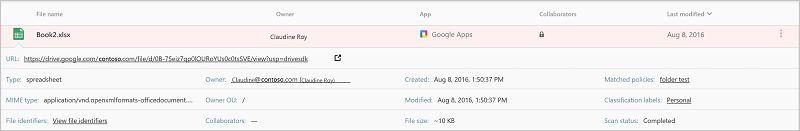

# 파일

*적용 대상: Microsoft Cloud App Security*

데이터 보호를 제공하기 위해 Microsoft Cloud App Security에서는 연결된 앱의 모든 파일을 볼 수 있습니다. 앱 커넥터를 사용하여 앱에 Microsoft Cloud App Security를 연결하면 Microsoft Cloud App Security는 OneDrive 및 Salesforce에 저장된 모든 파일 등과 같은 모든 파일을 검색합니다. 그런 다음, Cloud App Security는 파일이 수정될 때마다 각 파일을 다시 검색합니다. 이러한 수정의 예로 콘텐츠, 메타데이터, 공유 권한 수정 등을 들 수 있습니다. 검색 시간은 앱에 저장된 파일의 수에 따라 달라집니다. 또한 **파일** 페이지에서 파일을 필터링하여 어떤 종류의 데이터가 클라우드 앱에 저장되어 있는지 조사할 수도 있습니다.

## 파일 필터 예제

예를 들어 **파일** 페이지를 사용하여 다음과 같이 **기밀**로 레이블이 지정된 외부적으로 공유된 파일을 보호합니다. 앱을 Cloud App Security에 연결한 후 Azure Information Protection과 통합합니다. 그런 다음, **파일** 페이지에서 **기밀**로 레이블이 지정된 파일을 필터링하고 **협력자** 필터에서 도메인을 제외합니다. 조직 외부에서 공유되는 기밀 파일이 있는 경우 이를 검색하는 파일 정책을 만들 수 있습니다. **외부 협력자 제거** 및 **파일 소유자에게 정책 일치 다이제스트 보내기**와 같이 이러한 파일에 자동 거버런스 작업을 적용하여 조직의 데이터 손실을 방지할 수 있습니다.

 

다음은 **파일** 페이지를 사용하는 방법에 대한 또 다른 예입니다. 지난 6개월 동안 수정되지 않은 파일을 공유적으로 또는 외부에서 공유하는 사람이 없는지 확인합니다. 앱을 Cloud App Security에 연결하고 **파일** 페이지로 이동합니다. 액세스 수준이 **외부** 또는 **공용**인 파일을 필터링 **최종 수정** 날짜를 6개월 전으로 설정합니다. **검색을 통한 새 정책**을 클릭하여 이러한 부실 공개 파일을 검색하는 파일 정책을 만듭니다. **외부 사용자 제거**와 같은 자동 거버런스 작업을 적용하여 조직에 대한 데이터 손실을 방지합니다.

 

기본 필터는 파일 필터링을 시작하기에 좋은 도구를 제공합니다.

 

더 구체적인 파일로 드릴다운하려면 [고급]을 클릭하여 기본 필터를 확장합니다.

 
 
##  파일 필터
 
Cloud App Security는 20개가 넘는 메타데이터 필터(예: 액세스 수준, 파일 형식)를 기반으로 모든 파일 형식을 모니터링할 수 있습니다. 
 
Cloud App Security의 기본 제공 DLP 엔진은 일반적인 파일 형식에서 텍스트를 추출하여 콘텐츠 검사를 수행합니다. 포함된 파일 형식 중 일부는 PDF, Office 파일, RTF, HTML 및 코드 파일입니다.

다음은 적용할 수 있는 파일 필터 목록입니다. 강력한 정책 만들기 도구를 제공하기 위해 대부분의 필터는 여러 값과 NOT을 지원합니다.  
> [!NOTE]
> 파일 정책 필터를 사용하는 경우 **포함**은 쉼표, 점, 공백 또는 밑줄로 구분된 **전체 단어**만 검색합니다. 
> - 단어 사이의 공백은 OR처럼 작동합니다. 예를 들어 **malware** **virus**를 검색하는 경우 이름에 malware나 virus가 있는 파일을 모두 찾으므로 malware-virus.exe와 virus.exe를 모두 찾습니다.  
> - 문자열을 검색하려면 단어를 따옴표로 묶습니다. 이 경우 AND처럼 작동합니다. 예를 들어 **"malware"** **"virus"** 를 검색하는 경우 virus_malware_file.exe는 찾지만 malwarevirusfile.exe 및 malware.exe는 찾지 않습니다. 그러나 정확한 문자열을 검색합니다. 즉, **"malware virus"** 를 검색하는 경우 **"virus"** 또는 **"virus_malware"** 를 찾지 않습니다.
>
> **같음**은 전체 문자열만 검색합니다. 예를 들어 **malware.exe**를 검색하는 경우 malware.exe를 찾지만 malware.exe.txt는 찾지 않습니다. 

- **액세스 수준** – 공유 액세스 수준(공개, 외부, 내부 또는 전용)입니다.  외부 파일에 대한 자세한 내용은 [일반 설정, 포털 설정](getting-started-with-cloud-app-security.md)을 참조하세요.

    - **내부** - [일반 설정](General-setup.md)에서 설정한 내부 도메인 내의 모든 파일입니다. 
    - **외부** - 설정한 내부 도메인에 속하지 않는 위치에 저장된 모든 파일입니다. 
    - **공유** - 공유 수준이 전용보다 높은 파일입니다. 공유 내용:
        -  내부 공유 - 내부 도메인 내에서 공유되는 파일입니다.
        -  외부 공유 - 내부 도메인에 나열되지 않은 도메인에서 공유되는 파일입니다.
        - 링크가 있는 공개 - 링크를 통해 다른 사람과 공유할 수 있는 파일입니다.
        -  공개 - 인터넷을 검색하여 찾을 수 있는 파일입니다. 

      > [!NOTE]
      >  외부 사용자에 의해 연결된 스토리지 응용 프로그램에 공유된 파일은 Cloud App Security에서 다음과 같이 처리됩니다.
      > - **OneDrive:** OneDrive는 외부 사용자가 OneDrive에 넣는 모든 파일의 소유자로 내부 사용자를 할당합니다. 그러면 이러한 파일은 조직의 소유로 간주되므로 Cloud App Security에서 이러한 파일을 검색하고 OneDrive의 다른 모든 파일에서처럼 정책을 적용합니다.
      > - **Google Drive:** Google Drive에서는 이런 파일을 외부 사용자가 소유한 것으로 간주하며, 조직에서 소유하지 않은 파일 및 데이터의 법적 제한 때문에 Cloud App Security에서 이러한 파일에 액세스할 수 없습니다.
      > - **Box:** Box에서는 외부에서 소유한 파일을 개인 정보로 간주하므로 Box 글로벌 관리자가 파일의 내용을 볼 수 없습니다. 이러한 이유로 Cloud App Security에서 이러한 파일에 액세스할 수 없습니다. 
      > - **Dropbox:** Dropbox에서는 외부에서 소유한 파일을 개인 정보로 간주하므로 Dropbox 글로벌 관리자가 파일의 내용을 볼 수 없습니다. 이러한 이유로 Cloud App Security에서 이러한 파일에 액세스할 수 없습니다.

- **앱** – 해당 앱 내의 파일만 검색합니다.  
  
- **협력자** - 특정 협력자 그룹을 포함/제외합니다.  
  
    - **도메인 중 하나** - 이 도메인의 사용자 중 하나가 파일에 액세스할 수 있는 경우입니다.  
  
    - **전체 도메인** – 전체 도메인이 파일에 액세스할 수 있는 경우입니다.  
  
    - **그룹** – 특정 그룹이 파일에 액세스할 수 있는 경우입니다. Active Directory 또는 클라우드 앱에서 그룹을 가져오거나 서비스에서 수동으로 만들 수 있습니다.  
  
    - **사용자** - 파일에 액세스할 수 있는 특정 사용자 집합입니다.  
  
- **만든 날짜** – 파일을 만든 시간입니다. 필터는 이전/이후 날짜와 날짜 범위를 지원합니다.  
  
- **확장명** - 특정 파일 확장명에 중점을 둡니다. 예를 들어 실행 파일(exe)인 모든 파일입니다.  
  
- **파일 ID** - 특정 파일 ID를 검색하는 파일 ID는 소유자, 위치, 또는 이름을 사용하지 않고 중요한 특정 파일을 추적할 수 있는 고급 기능입니다.  
  
- **파일 이름** - 클라우드 앱에 정의된 이름의 파일 이름 또는 하위 문자열입니다(예: 이름에 암호가 포함된 모든 파일).   
  
- **분류 레이블** - 설정된 특정 태그를 사용하여 파일을 검색합니다. 레이블은 다음 중 하나입니다.
    - **Azure Information Protection 태그** - Azure Information Protection과 통합해야 합니다.
    - **Cloud App Security 태그** - 검색하는 파일에 대한 더 많은 정보를 제공합니다. Cloud App Security DLP에서 검색한 각 파일에 대해 파일이 암호화되거나 손상되어 검사가 차단되었는지 알 수 있습니다. 예를 들어 외부에서 공유되는 암호로 보호된 파일에 대해 경고하고 이를 격리하는 정책을 설정할 수 있습니다.
        - **Azure RMS로 암호화** – 파일에 Azure RMS 암호가 설정되어 있어 해당 콘텐츠가 검사되지 않은 파일입니다.
        - **암호로 암호화** – 파일이 사용자에 의해 암호로 보호되어 해당 콘텐츠가 검사되지 않은 파일입니다.
        - **손상 파일** – 파일 콘텐츠를 읽을 수 없어 해당 콘텐츠가 검사되지 않은 파일입니다.

- **파일 형식** – Cloud App Security는 서비스에서 받은 MIME 형식을 모두 사용하고 파일을 검색하여 실제 파일 형식을 확인합니다. 이 검색은 데이터 검색과 관련된 파일(문서, 이미지, 프레젠테이션, 스프레드시트, 텍스트 및 zip/보관 파일)에 대해 수행됩니다. 필터는 파일/폴더 형식별로 작동합니다. 예: ...인 모든 폴더 또는 ...인 모든 스프레드시트 파일

     

  
- **휴지통** – 휴지통 폴더의 파일을 제외/포함합니다. 이러한 파일도 여전히 공유될 수 있으며 위험을 발생시킵니다.  
  
- **마지막으로 수정한 날짜** - 파일 수정 시간입니다. 필터는 이전 및 이후 날짜, 날짜 범위 및 상대 시간 식을 지원합니다. 예를 들어 지난 6개월 동안 수정 되지 않은 모든 파일입니다.  

- **일치 정책** - 활성 Cloud App Security 정책과 일치하는 파일입니다.

- **MIME 형식** – 파일 MIME 형식 검사이며 일반 텍스트를 수락합니다.  
  
- **소유자** - 특정 파일 소유자를 포함/제외합니다. 예를 들어 rogue_employee_#100에서 공유하는 모든 파일을 추적합니다.  
  
- **소유자 OU** – 특정 조직 그룹에 속하는 파일 소유자를 포함하거나 제외합니다. 예를 들어 EMEA_marketing에서 공유하는 파일을 제외한 모든 공개 파일입니다. Google Drive에 저장된 파일에만 적용됩니다.
  
- **부모 폴더** – 부모 폴더를 기준으로 포함하거나 제외합니다. 예를 들어 이 폴더의 파일을 제외한 공개적으로 공유된 모든 파일입니다.  
  
- **격리** – 서비스에서 격리된 파일입니다(예: 격리된 모든 파일 표시).  
  
**적용 대상** 필터를 설정하여 특정 파일에서 실행할 정책을 설정할 수도 있습니다. **모든 파일**, **선택한 폴더** 또는 **선택한 폴더를 제외한 모든 파일**로 필터링합니다. 그런 다음, 관련된 파일이나 폴더를 선택합니다.  
  
  
<!-- 
>[!NOTE]
> If at any point you want to clear the filters, you can do so by clicking the clear filters icon .
-->

## 파일 서랍 사용

파일 로그에서 파일 자체를 클릭하여 각 파일에 관한 자세한 정보를 볼 수 있습니다. 클릭하면 파일에서 수행할 수 있는 다음 추가 작업을 제공하는 **파일 서랍이 열립니다.

- **URL** - 파일 위치로 이동합니다.
- **파일 식별자** - 파일 ID, 암호화 키를 비롯한 파일에 관한 원시 데이터 정보가 포함된 팝업이 열립니다.
- **소유자** - 이 파일의 소유자에 대한 사용자 페이지를 봅니다.
- **일치된 정책** - 파일이 일치하는 정책 목록을 확인합니다.
- **분류 레이블** - 이 파일에 있는 Azure Information Protection 분류 레이블 목록을 봅니다. 그런 다음 이 레이블과 일치하는 모든 파일을 기준으로 필터링할 수 있습니다.

파일 서랍의 필드는 추가 파일에 대한 상황별 링크 및 서랍에서 직접 수행할 수 있는 드릴다운을 제공합니다. 예를 들어 **소유자** 필드 옆으로 커서를 이동하면 "필터에 추가" 아이콘()을 사용하여 현재 페이지의 필터에 소유자를 즉시 추가할 수 있습니다. 또한 설정 톱니 아이콘()을 사용하면 **분류 레이블**과 같은 필드 중 하나의 구성을 수정하는 데 필요한 설정 페이지가 표시되므로 바로 작업할 수 있습니다.

  
  
사용할 수 있는 거버넌스 작업 목록은 [파일 거버넌스 작업](governance-actions.md#file-governance-actions)을 참조하세요.

## 다음 단계
  
[클라우드 환경을 보호하는 일상적인 활동](daily-activities-to-protect-your-cloud-environment.md)   

[프리미어 고객은 프리미어 포털에서 직접 새 지원 요청을 만들 수도 있습니다.](https://premier.microsoft.com/)  
  
  
