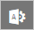

#  빠른 시작: Microsoft Cloud App Security 시작하기

*적용 대상: Microsoft Cloud App Security*

이 빠른 시작에서는 Cloud App Security에서 실행하는 단계를 제공합니다. Microsoft Cloud App Security는 클라우드 애플리케이션의 이점을 활용하는 한편 회사 리소스의 제어를 유지 관리하도록 지원할 수 있습니다. 클라우드 활동의 가시성을 개선하고 회사 데이터의 보호를 강화할 수 있도록 돕는 방식으로 작동합니다. 이 문서에서는 Microsoft Cloud App Security를 설정하고 사용하는 단계를 안내합니다.  

조직에 Cloud App Security 사용 라이선스가 있어야 합니다. 자세한 내용은 Cloud App Security 홈페이지에서 [Cloud App Security를 구입하는 방법](https://www.microsoft.com/cloud-platform/cloud-app-security) 섹션을 참조하세요.  

>[!NOTE]
>Office 365 라이선스가 없어도 Cloud App Security를 사용할 수 있습니다.  

## 필수 구성 요소  
  
- 조직에는 Cloud App Security에서 제품을 사용할 수 있는 라이선스가 있어야 합니다. 자세한 내용은 Cloud App Security 홈페이지에서 [Cloud App Security를 구입하는 방법](https://www.microsoft.com/cloud-platform/cloud-app-security) 섹션을 참조하세요.  
  
     테넌트 정품 인증 지원에 대한 자세한 내용은 [비즈니스용 Office 365 지원 문의 - 관리자 도움말](https://support.office.com/article/Contact-Office-365-for-business-support-Admin-Help-32a17ca7-6fa0-4870-8a8d-e25ba4ccfd4b)을 참조하세요.  
- Cloud App Security에 대한 라이선스가 있으면 정품 인증 정보와 Cloud App Security 포털에 대한 링크가 포함된 이메일을 받게 됩니다.  
  
- Cloud App Security를 설정하려면 Azure Active Directory 또는 Office 365에서 글로벌 관리자, 준수 관리자 또는 보안 읽기 권한자여야 합니다. 관리자 역할이 할당된 사용자는 조직에서 구독한 모든 클라우드 앱에서 동일한 권한을 갖게 됨을 이해하는 것이 중요합니다. 이는 Microsoft 365 관리 센터 또는 Azure 클래식 포털에서 역할을 할당하거나 또는 [Windows PowerShell](https://technet.microsoft.com/library/mt736914.aspx)에 Azure AD 모듈을 사용하는지 여부와 무관합니다. 자세한 내용은 [Office 365에서 관리자 역할 할당](https://support.office.com/article/Assigning-admin-roles-in-Office-365-eac4d046-1afd-4f1a-85fc-8219c79e1504) 및 [Azure Active Directory에서 관리자 역할 할당](https://azure.microsoft.com/documentation/articles/active-directory-assign-admin-roles/)을 참조하세요.  
  
- Cloud App Security 포털을 실행하려면 Internet Explorer 11, Microsoft Edge(최신 버전), Google Chrome(최신 버전), Mozilla Firefox(최신 버전) 또는 Apple Safari(최신 버전)을 사용합니다.  

## 포털에 액세스하려면

Cloud App Security 포털에 액세스하려면 [https://portal.cloudappsecurity.com](https://portal.cloudappsecurity.com)으로 이동하세요.  
관리 센터 아이콘을 클릭하여 **Microsoft 365 관리 센터**를 통해 포털에 액세스할 수도 있습니다.  그런 다음, **Cloud App Security**를 선택합니다.  
  
  
  

## 1단계. [응용 프로그램에 대해 인스턴트 표시 유형, 보호 및 거버넌스 작업을 사용합니다](enable-instant-visibility-protection-and-governance-actions-for-your-apps.md).
필요한 작업: 앱 연결

1. 설정 코그에서 **앱 커넥터**를 선택합니다.
2. 더하기 기호를 클릭하여 앱을 추가하고 앱을 선택합니다.
3. 구성 단계에 따라 앱을 연결합니다.

**앱을 연결해야 하는 이유는 무엇일까요?**
응용 프로그램을 연결한 후, 클라우드 환경에서 응용 프로그램의 활동, 파일 및 계정을 조사할 수 있도록 심층 정보를 확인할 수 있습니다.

## 2단계. [정책을 사용하여 클라우드 앱 제어](control-cloud-apps-with-policies.md).
필요한 작업: 정책 만들기

**정책을 만들려면**

1. **제어** > **템플릿**으로 이동합니다.
2. 목록에서 정책 템플릿을 선택하고 (+) **정책 만들기**를 선택합니다.
3. 정책을 사용자 지정한 다음(필터, 작업 및 기타 설정 선택) **만들기**를 선택합니다.
4. **정책** 탭에서 정책을 선택하여 관련된 일치 항목(활동, 파일, 경고)을 확인합니다.
 팁: 모든 클라우드 환경 보안 시나리오에 적용하려면 각 **위험 범주**별로 정책을 만듭니다.

**정책은 조직에 어떤 도움을 줄 수 있을까요?**
정책을 사용하면 추세 모니터링, 보안 위협 파악, 사용자 지정 보고서 및 경고 생성에 도움이 됩니다. 정책을 사용하면 거버넌스 작업을 만들고 데이터 손실 방지 및 파일 공유 컨트롤을 설정할 수 있습니다.

## 3단계. [클라우드 검색 설정](set-up-cloud-discovery.md).

필요한 작업: 클라우드 앱 사용을 볼 수 있도록 Cloud App Security 설정

1. Cloud App Security가 자동으로 회사 내부 및 외부에서 Windows 10 디바이스를 모니터링할 수 있도록 [Microsoft Defender ATP와 통합](wdatp-integration.md)합니다.
2. Zscaler를 사용하는 경우 Cloud App Security와 [Zscaler를 통합](zscaler-integration.md)합니다.
3. 전체적으로 적용하려면 연속 Cloud Discovery 보고서를 만듭니다.

   1. 설정 코그에서 **Cloud Discovery 설정**을 선택합니다.
   2. **자동 로그 업로드**를 선택합니다.
   3. **데이터 원본** 탭에서 원본을 추가합니다.
   4. **로그 수집기** 탭에서 로그 수집기를 구성합니다.
 
**Cloud Discovery 스냅숏 보고서를 만들려면**

 **검색** > **스냅숏 보고서**로 이동하고 표시되는 단계를 따릅니다.

**Cloud Discovery 보고서를 구성해야 하는 이유는 무엇일까요?**
조직의 섀도 IT를 파악하는 것이 중요합니다.
로그를 분석한 후에는 누가 어떤 디바이스에서 어떤 클라우드 앱을 사용하는지 쉽게 찾을 수 있습니다.

## 4단계. [환경 개인 설정](mail-settings.md).
권장 작업: 조직 정보 추가

**메일 설정을 입력하려면**

1. 설정 코그에서 **메일 설정**을 선택합니다.
2. **메일 보낸 사람 ID**에서 메일 주소와 표시 이름을 입력합니다.
3. **메일 디자인**에서 조직의 메일 템플릿을 업로드합니다.

**관리자 알림을 설정하려면**

1. 탐색 모음에서 사용자 이름을 선택한 다음 **사용자 설정**으로 이동합니다.
2. **알림**에서 시스템 알림에 대해 설정할 방법을 구성합니다.
3. **저장**을 선택합니다.

**점수 메트릭을 사용자 지정하려면**

1. 설정 코그에서 **Cloud Discovery 설정**을 선택합니다.
1. 설정 코그에서 **Cloud Discovery 설정**을 선택합니다.
2. **점수 메트릭** 아래에서 다양한 위험 값의 중요도를 구성합니다.
3. **저장**을 선택합니다.

이제 검색된 앱에 제공되는 위험 점수가 조직 요구 및 우선 순위에 따라 정확하게 구성됩니다.

**사용자 환경을 개인 설정해야 하는 이유는 무엇일까요?**
일부 기능은 사용자의 요구에 맞게 사용자 지정한 경우에 가장 잘 작동합니다. 고유한 이메일 템플릿을 사용하여 사용자에게 더 나은 환경을 제공합니다. 수신할 알림을 결정하고, 위험 점수 메트릭을 조직의 기본 설정에 맞게 사용자 지정합니다.

## 5단계. [필요에 따라 데이터 구성](ip-tags.md).
권장 작업: 중요한 설정 구성

**IP 주소 태그를 만들려면**

1. 설정 코그에서 **Cloud Discovery 설정**을 선택합니다.
1. 설정 코그에서 **IP 주소 범위**를 선택합니다.
2. 더하기 기호를 클릭하여 IP 주소 범위를 추가합니다.
3. IP 범위 **세부 정보**, **위치**, **태그** 및 **범주**를 입력합니다.
4. **만들기**를 선택합니다.

   이제 정책을 만들 때와 연속 보고서를 필터링하고 만들 때 IP 태그를 사용할 수 있습니다.

**연속 보고서 만들기**

1. 설정 코그에서 **Cloud Discovery 설정**을 선택합니다.
2. **연속 보고서** 아래에서 **보고서 만들기**를 선택합니다.
3. 구성 단계를 따릅니다.
4. **만들기**를 선택합니다.

이제 사업부 또는 IP 범위와 같은 사용자 기본 설정에 따라 검색된 데이터를 볼 수 있습니다.

**도메인을 추가하려면**

1. 설정 코그에서 **설정**을 선택합니다.
2. **조직 세부 정보**에서 조직의 내부 도메인을 추가합니다.
3. **저장**을 선택합니다.

**이러한 설정을 구성해야 하는 이유는 무엇일까요?**
이러한 설정은 콘솔의 기능을 보다 효율적으로 제어하는 데 도움이 됩니다. IP 태그를 사용하면 더 쉽게 요구에 맞는 정책을 만들고 정확하게 데이터를 필터링할 수 있습니다. 데이터 뷰를 사용하여 데이터를 논리적 범주로 그룹화할 수 있습니다.
  

## 다음 단계

정책 설정 [정책을 사용하여 클라우드 앱 제어](control-cloud-apps-with-policies.md)    

[프리미어 고객은 프리미어 포털에서 직접 새 지원 요청을 만들 수도 있습니다.](https://premier.microsoft.com/)   
