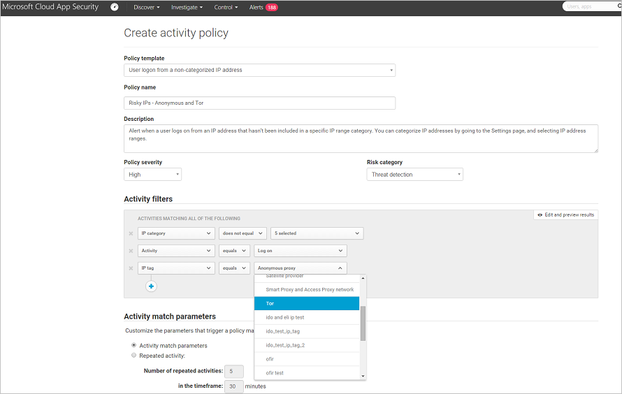

# 조사

*적용 대상: Microsoft Cloud App Security*

클라우드 환경에서 Microsoft Cloud App Security를 실행한 후에는 학습 및 조사 단계가 필요합니다. Microsoft Cloud App Security 도구를 사용하여 클라우드 환경에서 발생하는 일에 대해 더 깊이 이해하는 방법을 알아봅니다. 특정 환경 및 사용 방법에 따라 위험으로부터 조직을 보호하기 위한 요구 사항을 식별할 수 있습니다. 이 문서에서는 조사를 수행하여 클라우드 환경을 보다 잘 이해하는 방법을 설명합니다.  

## 대시보드  
다음 대시보드를 사용하여 클라우드 환경에서 응용 프로그램을 조사할 수 있습니다.  

|대시보드|설명|  
|---------------|-----------------|  
|기본 대시보드|클라우드 상태(사용자, 파일, 활동) 및 필요한 작업(경고, 활동 위반 및 콘텐츠 위반) 개요|  
|애플리케이션 대시보드: 전체|위치별 애플리케이션 사용 현황, 사용자 수당 사용량 그래프 개요|  
|애플리케이션 대시보드: 정보 활용|파일 형식 및 파일 공유 수준별로 세분화된 앱에 저장된 데이터 분석|  
|애플리케이션 대시보드: 파일|소유자, 공유 수준 등에 따라 필터링하는 기능인 파일로 드릴다운하고 거버넌스 작업을 수행합니다(예: 격리).|  
|애플리케이션 대시보드: 타사 앱|G Suite 등의 현재 배포된 타사 앱을 드릴다운하고 정책 정의|  
|사용자 대시보드|그룹, 위치, 최근 활동, 관련 경고, 사용된 브라우저 등 클라우드에서 사용자 프로필의 전체 개요|  

##   앱에 승인 또는 미승인 권한으로 태그 지정  
클라우드를 이해하는 중요한 단계는 앱에 승인 또는 미승인 태그를 지정하는 것입니다. 앱에 사용 권한을 부여한 후 사용 권한이 부여되지 않은 앱을 필터링하고 동일한 유형의 사용 권한 앱으로 마이그레이션을 시작할 수 있습니다.  

- Cloud App Security 콘솔에서 앱 카탈로그 또는 검색된 앱으로 이동합니다.  

- 앱 목록에서 승인 태그를 지정하려는 앱이 표시되는 행에서  행의 끝에 있는 세 점을 선택하고 **승인됨으로 표시**를 선택합니다.  

       

## 조사 도구 사용  

1. Cloud App Security 포털에서 **조사**로 이동한 다음 **활동 로그**를 확인하고 특정 앱을 기준으로 필터링합니다. 다음 항목을 확인합니다.  

    - 누가 클라우드 환경에 액세스하나요?  

    - 어떤 IP 범위에서 액세스하나요?  

    - 관리자 활동은 무엇인가요?  

    - 어떤 위치에서 관리자가 연결하나요?  

    - 클라우드 환경에 연결하는 오래된 디바이스가 있나요?  

    - 실패한 로그인이 예상 IP 주소에서 생성되나요?  

2. **조사**, **파일**로 이동한 후, 다음 항목을 확인합니다.  

    - 누구나 링크 없이 액세스할 수 있도록 공개적으로 공유되는 파일 수는 몇 개인가요?  

    - 어떤 파트너와 파일을 공유하나요(아웃바운드 공유)?  

    - 중요한 이름을 가진 파일이 있나요?  

    - 다른 사용자의 개인 계정과 공유되는 파일이 있나요?  

3. **조사**, **사용자 및 계정**으로 이동한 후, 다음 항목을 확인합니다.  

    - 특정 서비스를 오래 사용하지 않은 계정이 있나요? 아마도 사용자의 서비스 라이선스를 해지할 수 있습니다.  

    - 특정 역할을 가진 사용자를 알고 싶으세요?  

    - 누군가가 해고되었는데 여전히 앱에 대한 액세스 권한이 있고, 이 액세스 권한을 사용하여 정보를 훔칠 수 있나요?  

    - 특정 앱에 대한 사용자 권한을 해지하거나 특정 사용자가 다단계 인증을 사용하도록 요구하려고 하나요?  

    - 사용자 계정 행 끝의 세 개의 점을 클릭하고 수행할 작업을 선택하여 사용자 계정으로 드릴다운할 수 있습니다. **사용자 일시 중단** 또는 **사용자의 공동 작업 제거**와 같은 작업을 수행하세요. 사용자를 Azure Active Directory에서 가져온 경우 **Azure AD 계정 설정**을 클릭하여 고급 사용자 관리 기능에 쉽게 액세스할 수도 있습니다. 관리 기능의 예로는 그룹 관리, MFA, 사용자의 로그인 기능에 대한 세부 정보 및 로그인 차단 기능이 있습니다.

4. **조사** 및 **연결된 앱**으로 이동한 다음, 앱을 선택합니다. 응용 프로그램 대시보드가 열리며 정보와 활용 방법을 제공합니다. 위쪽에 있는 탭을 사용하여 다음을 확인할 수 있습니다.  

    - 사용자가 앱에 연결하는 데 사용 중인 디바이스 종류는 무엇인가요?  

    - 클라우드에 어떤 형식의 파일을 저장하나요?  

    - 지금 앱에서 어떤 활동이 발생하고 있나요?  

    - 환경에 연결된 타사 앱이 있나요?  

    - 이러한 앱에 대해 잘 알고 있나요?  

    - 허용되는 액세스 수준에 대해 권한이 부여되었나요?  

    - 배포한 사용자 수는 몇 명인가요? 총체적으로 이러한 앱은 얼마나 일반적인가요?  
 
      

5. **클라우드 검색 대시보드**로 이동하여 다음 항목을 확인합니다.  

    - 사용 중인 클라우드 앱은 무엇이며 어떤 사용자가 어느 정도까지 사용 중인가요?  

    - 어떤 용도로 사용되고 있나요?  

    - 얼마나 많은 데이터가 이러한 클라우드 앱에 업로드되고 있나요?  

    - 어떤 범주에 권한 부여 클라우드 앱이 있으며, 사용자가 대체 솔루션을 사용 중인가요?  

    - 대체 솔루션에서, 조직에 있는 클라우드 응용 프로그램의 권한을 취소하고 싶은가요?  

    - 사용되었지만 조직의 정책을 준수하지 않는 클라우드 앱이 있나요?  

## 샘플 조사
  
위험한 IP 주소로 클라우드 환경에 액세스할 수 없다고 가정해 보겠습니다. 예를 들어 Tor를 가정해 보겠습니다. 그러나 다음을 확인하기 위해서라도 위험한 IP에 대한 정책을 만듭니다.  

1. 포털에서 **제어**로 이동하여 **템플릿**을 선택합니다.  

2. **형식**에 대한 **활동 정책**을 선택합니다.  

3. **위험한 IP 주소에서 로그온** 행의 끝에서 더하기 기호(**+**)를 선택하여 새 정책을 만듭니다.  

4. 정책 이름을 식별할 수 있도록 변경합니다.  

5. **다음 항목과 모두 일치하는 활동**에서 **+** 를 선택하여 필터를 추가합니다. 아래의 **IP 태그**로 스크롤한 다음, **Tor**를 선택합니다.  

       

이제 정책이 구현되었으며 정책이 위반되었다는 경고가 표시됩니다.  

1. **경고** 페이지로 이동한 다음 정책 위반에 대한 경고를 봅니다.  

2. 실제 위반처럼 보이는 경우 위험을 포함하거나 수정해야 합니다.  

     위험을 포함하려면 위반이 의도적인 것인지 여부 및 사용자가 알고 있었는지 여부를 묻는 알림을 사용자에게 보낼 수 있습니다.  

     또한 경고로 드릴다운하고 수행해야 하는 작업을 확인할 수 있을 때까지 사용자를 일시 중단할 수도 있습니다.  

3. 반복되지 않는 허용된 이벤트인 경우 경고를 해제할 수 있습니다.  

     허용되며 반복될 것으로 예상되는 경우 나중에 이 유형의 이벤트가 위반으로 간주되지 않도록 정책을 변경할 수 있습니다.  

## 다음 단계
 
조직의 클라우드 응용 프로그램 제어 방법을 알아보려면 [제어](control.md)를 참조하세요.   

[프리미어 고객은 프리미어 포털에서 직접 새 지원 요청을 만들 수도 있습니다.](https://premier.microsoft.com/)  
