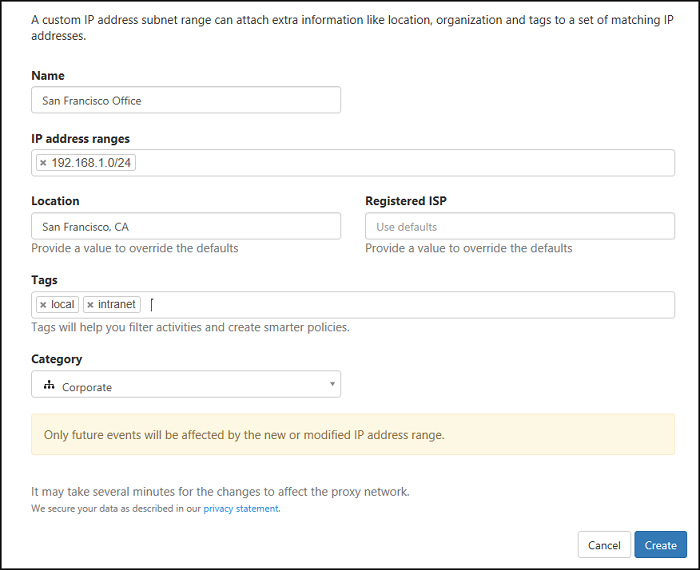

#   IP 범위 및 태그 사용

실제 사무실 IP 주소 등 알려진 IP 주소를 쉽게 식별하려면 로그 및 경고를 표시 및 조사하는 방법에 태그를 지정하고 적절하게 분류 및 사용자 지정할 수 있도록 IP 주소 범위를 설정해야 합니다.   
각 IP 범위 그룹을 IP 범주의 사전 설정 목록에 따라 분류하거나 직접 만든 IP 태그를 사용하여 태그를 지정할 수 있습니다. 또한 이 설정을 통해 내부 네트워크 지식에 따라 공용 지리적 위치 정보를 재정의할 수 있습니다.  
  
IPv4 및 IPv6이 지원됩니다.  
  
Cloud App Security는 다음 IP 주소에 대한 기본 제공 태그로 미리 구성됩니다. 
- 네이티브 클라이언트
- 오래된 운영 체제
- 관리되는 장치
- 익명 프록시
- 봇넷
- Tor
- 규격 장치
- 확인된 장치
- 가장

검색의 일부로 이러한 기본 제공 태그를 사용하려면 Cloud App Security API 설명서에서 해당 ID를 참조하세요. 

메뉴 모음에서 설정 아이콘 을 클릭하고 **IP 주소 범위**를 선택합니다. **+IP 주소 범위 추가**를 클릭하고 다음을 설정합니다.  
  
> [!NOTE]  
>  위치 및 등록된 ISP가 기본값을 재정의합니다.   
> 그러나 IP 태그는 데이터를 재정의하지 않고 활동에 추가됩니다.  
  
1.  IP 범위에 **이름**을 지정합니다. 이 이름은 활동 로그에 표시되지 않고 IP 범위를 관리하는 데만 사용됩니다.  
  
     IP 범위를 IP 범주에 포함하려면 드롭다운 메뉴에서 범주를 선택합니다.  
  
2.  구성하려는 **IP 주소 범위**를 입력하고 "+" 단추를 클릭합니다. 네트워크 접두사 표기법(CIDR 표기법이라고도 함, 예: 192.168.1.0/32)을 사용하여 IP 주소 및 서브넷을 원하는 개수만큼 추가할 수 있습니다.  
  
3.  이러한 주소의 **위치** 또는 조직(ISP) 필드를 재정의하려면 새 값을 입력합니다. 예를 들어 공개적으로는 아일랜드에 있다고 간주되는 IP 주소가 있지만 실제로 미국에 있다는 것을 알고 있는 경우 이 설정을 재정의할 수 있습니다.  
  
4.  **등록된 ISP**를 입력합니다. 활동의 데이터가 재정의됩니다.  
  
5.  이러한 IP 주소의 작업에 **태그**를 지정하려면 태그를 입력합니다. 상자에 단어를 입력하면 태그가 생성됩니다. 이미 구성된 태그가 있으면 목록에서 선택하여 다른 IP 범위에 쉽게 추가할 수 있습니다. 각 범위에 대해 IP 태그를 원하는 개수만큼 추가할 수 있습니다. 정책을 만들 때 IP 태그를 사용할 수 있습니다.  구성 가능한 IP 태그 외에도 Cloud App Security에는 구성할 수 없는 기본 제공 태그가 있습니다. [IP 태그 필터](activity-filters.md) 아래에서 태그의 목록을 볼 수 있습니다.  
  
6.  **IP 범주**는 관심 있는 IP 주소의 활동을 쉽게 인식하는 데 사용됩니다. 범주는 포털에서 사용할 수 있지만 사용자 구성에서 각 범주에 포함되는 IP 주소를 결정해야 합니다. 단, 익명 프록시와 TOR이라는 두 개의 IP 태그를 포함하는 "위험" 범주는 제외됩니다.  
  
     다음 IP 범주를 사용할 수 있습니다.  
  
    -   **관리**: 관리자의 모든 IP 주소여야 합니다.  
  
    -   **내부**: 내부 네트워크, 지점 및 Wi-Fi 로밍 주소의 모든 IP 주소여야 합니다.  
  
    -   **위험**: 위험한 것으로 간주하는 모든 IP 주소여야 합니다. 여기에는 과거에 본 적이 있는 의심스러운 IP 주소, 경쟁업체의 네트워크에 있는 IP 주소 등이 포함될 수 있습니다.  
  
    -   **VPN**: 원격 작업자에 사용하는 모든 IP 주소여야 합니다.  
  
    -   **클라우드 프록시**: 클라우드에 있는 프록시의 IP 주소여야 합니다.  
  
7.  완료되면 **만들기**를 클릭합니다.  
  
       
  
  
    
## 참고 항목  
[Cloud Discovery 설정](set-up-cloud-discovery.md)   
[기술 지원을 받으려면 Cloud App Security 보조 지원 페이지를 방문하세요.](http://support.microsoft.com/oas/default.aspx?prid=16031)   
[프리미어 고객은 프리미어 포털에서 직접 Cloud App Security를 선택할 수도 있습니다.](https://premier.microsoft.com/)  
  
  