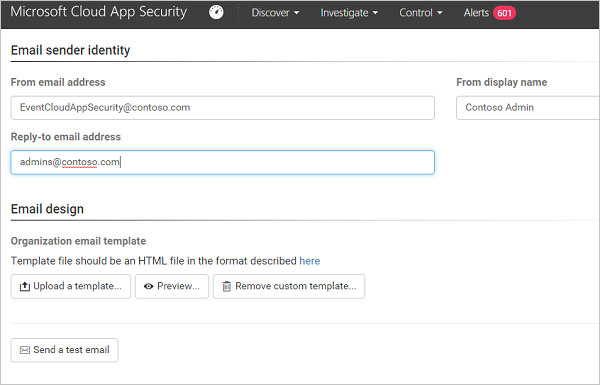

# <a name="email-notification-preferences"></a>이메일 알림 기본 설정

*적용 대상: Microsoft Cloud App Security*

이 문서에서는 위반이 검색될 때 Cloud App Security에서 사용자에게 보낸 이메일 알림을 개인 설정하는 방법에 대한 정보를 제공합니다.

> [!NOTE]
> 이러한 사용자 지정은 Cloud App Security 관리자에게 보낸 알림이 아닌 최종 사용자에게 보낸 알림에만 적용됩니다.

## <a name="mailsettings"></a> 메일 알림 기본 설정 설정  

 Microsoft Cloud App Security를 사용하면 위반에 관련하여 최종 사용자에게 보낸 이메일 알림을 사용자 지정할 수 있습니다. 이메일 알림에 대한 매개 변수를 설정하려면 이 절차를 따릅니다. 스팸 방지 서비스에서 허용 목록에 포함해야 하는 Microsoft Cloud App Security 메일 서버 IP 주소에 대한 자세한 내용은 [네트워크 요구 사항](network-requirements.md)을 참조하세요.

1. 메뉴 모음에서 설정 코그를 클릭하고 **설정**을 선택한 다음, **메일 설정** 탭을 선택합니다.  

   

2. **이메일 보낸 사람 ID**에서: 기본 이메일 설정을 사용하려는 경우 이 섹션의 내용을 변경할 필요가 없습니다. 이메일 보낸 사람 ID를 사용자 지정하려는 경우 여기에서 설정을 지정하여 변경할 필드를 사용자 지정할 수 있습니다. 다음 항목 중 일부 또는 모두를 변경할 수 있습니다. **보낸 사람 표시 이름**, **보낸 사람 이메일 주소**, **회신 이메일 주소** Microsoft Cloud App Security는 MailChimp®라는 타사 메일 서비스를 사용하여 사용자 지정 작업을 수행합니다. 사용자 지정을 사용하려면 MailChimp의 서비스 약관 및 개인정보처리방침을 검토하고 동의해야 합니다. 그렇지 않으면 Microsoft Cloud App Security에서 기본 설정을 사용하여 알림을 보냅니다.
 
   > [!NOTE]
   > [rfc822 표준](https://www.rfc-editor.org/rfc/rfc822.txt)에 따라 표시 이름 및 메일 주소에서 유니코드 문자만 지원됩니다.

  
3. **메일 디자인**의 경우, html 파일을 사용하여 시스템에서 보내는 메일 메시지를 사용자 지정하고 디자인할 수 있습니다. 템플릿에 사용되는 html 파일에는 다음 사항이 포함되어야 합니다.  
  
   - 모든 템플릿 CSS 파일은 템플릿에 인라인으로 포함되어야 합니다.  
  
   - 템플릿에 편집할 수 없는 다음 3개의 자리 표시자가 있어야 합니다.  
  
        - **%%logo%%** - 일반 설정 페이지에서 업로드된 회사 로고의 URL입니다.  
  
        - **%%title%%** - 정책에 의해 설정된 이메일 제목의 자리 표시자입니다.  

        - **%%content%%** - 정책에 의해 설정된 최종 사용자에 대해 포함할 콘텐츠의 자리 표시자입니다.  

4. **템플릿 업로드...** 를 클릭하고 만든 파일을 선택합니다. 

5. **테스트 이메일 보내기**를 클릭하여 직접 만든 템플릿의 예를 이메일로 보내주세요. 포털에 로그인할 때 사용한 계정으로 메일이 전송됩니다. 테스트 이메일에서 다음 항목을 보고 확인합니다.
    - 메타데이터 필드
    - 템플릿
    - 이메일 제목
    - 이메일 본문의 제목
    - 콘텐츠

## <a name="sample-email-template"></a>샘플 이메일 템플릿

다음은 샘플 이메일 템플릿입니다.

```html
<!DOCTYPE html PUBLIC "-//W3C//DTD XHTML 1.0 Transitional//EN" "https://www.w3.org/TR/xhtml1/DTD/xhtml1-transitional.dtd">
  <html>  
       <head>  
            <meta http-equiv="Content-Type" content="text/html; charset=UTF-8"/>  
            <meta name="viewport" content="width=device-width, initial-scale=1.0"/>  
          </head>  
          <body class="end-user">  
          <table border="0" cellpadding="20%" cellspacing="0" width="100%" id="background-table">  
            <tr>  
              <td align="center">  
                <!--[if (gte mso 9)|(IE)]>  
                <table width="600" align="center" cellpadding="0" cellspacing="0" border="0">  
                  <tr>  
                    <td>  
                <![endif]-->  
                <table bgcolor="#ffffff" align="center" border="0" cellpadding="0" cellspacing="0" style="padding-bottom: 40px;" id="container-table">  
                  <tr>  
                    <td align="right" id="header-table-cell">  
                        
                    </td>  
                  </tr>  
                  <tr>  
                    <td style="padding-top: 58px;" align="center" valign="top">  
                      <table width="100%" cellpadding="12">  
                        <tr>  
                          <td align="center" class="round-title">  
                            %%title%%  
                          </td>  
                        </tr>  
                      </table>  
                    </td>  
                  </tr>  
                  <tr>  
                    <td style="padding: 0 40px 79px 40px;" class="content-table-cell" align="left" valign="top">  
                        %%content%%  
                    </td>  
                  </tr>  
                  <tr>  
                    <td class="last-row"></td>  
                  </tr>  
                </table>  
                <!--[if (gte mso 9)|(IE)]>  
                </td>  
                </tr>  
                </table>  
                  <![endif]-->  
              </td>  
              </tr>  
          </table>  
            </body>  
          </html>  
```

## <a name="next-steps"></a>다음 단계

[Cloud Discovery 설정](set-up-cloud-discovery.md)   

[프리미어 고객은 프리미어 포털에서 직접 새 지원 요청을 만들 수도 있습니다.](https://premier.microsoft.com/)  
  
  
