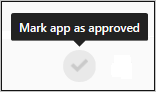

# OAuth 앱 관리

*적용 대상: Microsoft Cloud App Security*

조직의 비즈니스 사용자가 설치하는 타사 생산성 앱 중에는 사용자 정보와 데이터의 사용 권한을 요청하고 사용자 대신 Office 365, G Suite, Salesforce 등의 다른 클라우드 앱에 로그인하는 것도 많습니다. 사용자가 이러한 응용 프로그램을 설치할 때, 응용 프로그램에 사용 권한을 부여하는 내용을 포함한 메시지의 세부 정보를 검토하지 않고 승인을 클릭하는 경우도 많습니다. 이 문제는 IT 직원이 애플리케이션의 생산성 향상 효과와 보안 위험을 신중하게 비교하지 못하기 때문에 발생합니다. 타사 앱의 사용 권한을 승인하면 조직에 보안 위험이 생길 수 있으므로, 사용자가 부여하는 앱 사용 권한을 모니터링하면 사용자와 애플리케이션을 보호하는 데 필요한 정보를 얻고 상황을 통제할 수 있습니다. Microsoft Cloud App Security 앱 권한을 통해 사용자가 설치한 OAuth 애플리케이션이 Office 365 데이터, G Suite 데이터 및 Salesforce 데이터에 액세스할 수 있는지 확인할 수 있습니다. Cloud App Security는 앱이 가지고 있는 권한과 이러한 앱에 Office 365, G Suite 및 Salesforce 계정에 액세스 권한을 부여한 사용자를 알려줍니다. 앱 사용 권한은 사용자가 액세스할 수 있는 앱과 금지할 앱을 결정하는 데 도움이 됩니다.

## OAuth 앱 페이지 사용

**OAuth** 페이지에는 연결된 앱의 앱 사용 권한에 관한 정보가 표시됩니다.

OAuth 탭에 액세스하려면:

Cloud App Security 포털에서 **조사**를 클릭한 다음, **OAuth 앱**을 클릭합니다.

 

OAuth 앱 페이지는 사용 권한이 사용 권한이 부여된 각 OAuth 앱에 대해 다음과 같은 정보를 제공합니다.

|항목|의미|적용 대상|
|-------|-------|-------|
|응용 프로그램 쿼리 표시줄의 기본 아이콘  |기본 보기에서 쿼리로 전환합니다.|Office 365, G Suite, Salesforce|
|응용 프로그램 쿼리 표시줄의 고급 아이콘  |고급 보기에서 쿼리로 전환합니다.|Office 365, G Suite, Salesforce|
|응용 프로그램 목록에서 모든 세부 정보 아이콘 열기 또는 닫기  |각 앱에 대한 정보를 자세히 보거나 간단히 볼 수 있습니다.|
|응용 프로그램 목록의 내보내기 아이콘  |앱 목록, 각 앱의 사용자 수, 앱에 연관된 사용 권한, 사용 권한 수준, 앱 상태 및 커뮤니티 사용 수준이 포함된 CSV 파일을 내보냅니다.|Office 365, G Suite, Salesforce|
|앱|응용 프로그램의 이름입니다. 설명, 게시자(Office 365용), 앱 웹 사이트, ID를 포함한 자세한 정보를 보려면 이름을 선택합니다.|Office 365, G Suite, Salesforce|
|권한을 부여한 사용자|이 앱에서 사용자 앱의 계정에 액세스하도록 승인하고 앱 사용 권한을 부여한 사용자 수입니다. 사용자 이메일 목록과 관리자가 이전에 앱에 동의했는지 여부 등의 자세한 정보를 보려면 숫자를 선택합니다.|Office 365, G Suite, Salesforce|
|사용 권한 수준  |높음, 보통 또는 낮음을 나타내는 사용 권한 수준 아이콘과 텍스트입니다. 수준은 이 앱이 앱의 데이터에 대해 가진 액세스 권한이 어느 정도인지를 나타냅니다. 예를 들어 낮음은 응용 프로그램에서 사용자 프로필 이름에만 액세스하는 것을 나타낼 수 있습니다. 앱에 부여된 사용 권한, 커뮤니티 사용 또는 [거버넌스 로그](governance-actions.md)의 관련 활동과 같은 추가 정보를 보려면 수준을 선택합니다.|Office 365, G Suite|
|앱 상태|관리자가 응용 프로그램을 승인 또는 금지로 표시하거나 미확인 상태로 둘 수 있습니다.|Office 365, G Suite, Salesforce|
|커뮤니티 사용|모든 사용자에게 앱의 인기도를 보여줍니다(일반적임, 일반적이지 않음, 드뭄).|Office 365, G Suite, Salesforce|
|마지막으로 권한을 부여한 날짜|사용자가 이 앱에 권한을 부여한 최근 날짜입니다.|Office 365, Salesforce|
|게시자|앱을 제공하는 공급 업체의 이름입니다.|Office 365|
|마지막으로 사용한 날짜|조직의 사용자가 이 앱을 사용한 최근 날짜입니다.|Salesforce|

## 응용 프로그램 금지 또는 승인

1. **OAuth 앱** 페이지에서 앱을 클릭하여 **앱 서랍**을 열면 앱에 관한 자세한 정보와 부여된 사용 권한을 볼 수 있습니다.
   
   - **사용 권한** 링크를 클릭하면 앱에 부여된 사용 권한의 전체 목록을 볼 수 있습니다. 
   - **커뮤니티 사용**에서 다른 조직에 해당 앱이 얼마나 흔한지 확인할 수 있습니다.  
   - **관련 활동** 링크를 클릭하여 이 앱과 관련된 거버넌스 로그에 나열된 활동을 확인합니다.

2. 응용 프로그램을 금지하려면 표에서 응용 프로그램 행의 끝에 있는 금지 아이콘을 클릭합니다.
   
      

    - 사용자가 설치하고 권한을 부여받은 앱이 금지되었음을 사용자에게 알릴지 여부를 선택할 수 있습니다. 알림을 통해 앱이 비활성되고 연결된 앱에 대한 액세스 권한이 없다는 것을 사용자에게 알려줍니다. 사용자에게 알리지 않으려면 대화 상자에서 **이 금지된 앱에 액세스 권한을 부여한 사용자에게 알림**을 선택 취소합니다. 
    - 앱 사용자에게 앱 사용이 곧 금지되는 것을 알리는 편이 좋습니다.

      

3. 사용자 지정 알림 메시지 입력 상자에서 앱 사용자에게 보낼 메시지를 입력합니다. 메일을 보내고 연결된 앱 사용자의 앱 사용을 금지하려면 **앱 금지**를 클릭합니다.

4. 응용 프로그램을 승인하려면 표의 행 끝에 있는 승인 아이콘을 클릭합니다. 

    

   - 아이콘이 녹색으로 바뀌며 앱이 모든 연결된 앱 사용자에게 승인됩니다.
   - 앱을 승인된 것으로 표시해도 최종 사용자에게는 영향이 없습니다. 이 색 변화는 아직 검토하지 않은 앱과 구분하기 위해 승인한 앱을 볼 수 있도록 하기 위한 것입니다.

## 앱 철회 및 사용자에게 알림

G Suite 및 Salesforce의 경우 앱에 대한 사용 권한을 철회하거나 권한을 변경해야 함을 사용자에게 알릴 수 있습니다. 

1. **OAuth 앱** 페이지에서 앱 행의 끝에 있는 점 세 개를 클릭하고 **사용자에게 알림**을 선택합니다. 기본적으로 사용자에게 *G Suite 계정에 액세스할 수 있도록 앱에 권한을 부여함이라는 알림이 전송됩니다. 이 앱은 조직의 보안 정책과 충돌합니다. G Suite 계정에서 이 앱에 제공한 사용 권한의 부여 또는 취소를 다시 고려하세요. 앱 액세스를 취소하려면 https://security.google.com/settings/security/permissions?hl=en&pli=1로 이동하세요. 앱을 선택하고 오른쪽 메뉴 모음에서 ‘액세스 취소’를 클릭합니다.* 보내는 메시지를 사용자 지정할 수 있습니다.
2. 사용자에게 앱을 사용할 권한을 해지할 수도 있습니다. 표에 앱 행의 끝에 있는 아이콘을 클릭하고 **앱 철회**를 선택합니다. 

   

## OAuth 앱 쿼리

**기본** 보기나 **고급** 보기 중 하나에서 OAuth 앱을 쿼리할 수 있습니다. 하나 또는 여러 드롭다운에서 값을 선택하여 기본 보기에 특정 앱을 표시합니다. 고급 보기에서 **Select a filter**(필터 선택) 드롭다운을 사용하여 검색 범위를 좁힙니다. 연산자, 등호 또는 부등호와 같은 연산자를 선택된 값에 추가하여 쿼리를 완료합니다.

- 필터를 더 추가하여 쿼리 범위를 더 상세하게 조정하려면 **필터 추가**를 선택합니다. 필터가 자동으로 적용되고 앱 목록이 업데이트됩니다.

- 필터를 제거하려면 필터 옆에 있는 **필터 제거** 아이콘을 선택합니다.

## 피드백 보내기

조직에서 검색된, 악성인 것 같은 OAuth 앱이 있는 경우 Cloud App Security 팀으로 피드백을 보내 알릴 수 있습니다. 이 기능을 사용하여 보안 커뮤니티의 일원이 되고 OAuth 앱 위험 점수 및 분석을 향상할 수 있습니다.
1. **OAuth 앱** 페이지에서 앱 행의 끝에 있는 점 세 개를 클릭하고 **앱 보고**를 선택합니다.  

   
2. **이 앱 보고** 화면에서 앱을 악성으로 보고할지 또는 Cloud App Security가 앱을 인식하는 과정에서 발생한 다른 문제를 보고할지를 선택할 수 있습니다. 예를 들어 **잘못된 게시자**, **잘못된 사용 권한** 또는 **기타**를 사용할 수 있습니다. 제출하는 데이터는 앱의 위험 점수 및 기타 분석을 업데이트하는 데 사용됩니다.

## 다음 단계

[정책을 사용하여 클라우드 앱 제어](control-cloud-apps-with-policies.md)   

[프리미어 고객은 프리미어 포털에서 직접 새 지원 요청을 만들 수도 있습니다.](https://premier.microsoft.com/)  
