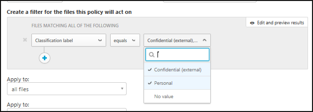

# 파일 제어 및 보호  

다량의 데이터 및 다양한 장치가 있는 오늘날의 기업 환경에서는 데이터가 어디에 있으며 누가 그 데이터에 액세스할 수 있는지를 추적하는 것이 어려울 수 있습니다. Cloud App Security를 통해 클라우드 전체에 파일 보호 기능을 사용하여 데이터를 제어할 수 있습니다. Cloud App Security는 회사 클라우드에서 무엇을 허용할지 또는 허용하지 않을지에 대한 정책을 만들 수 있는 도구를 제공하며, 광범위한 자동화된 프로세스를 제공함으로써 지속적인 준수 검색, 법적 eDiscovery 작업, 클라우드에 저장되거나 외부 또는 공개적으로 공유된 중요한 콘텐츠에 대한 DLP 및 다양한 사용 사례를 제공합니다.  
Cloud App Security는 20개가 넘는 메타데이터 필터(예: 액세스 수준, 파일 형식)를 기반으로 모든 파일 형식을 모니터링할 수 있습니다. 자세한 내용은 [파일](file-filters.md)을 참조하세요. 다음은 모든 조직이 직면한 데이터 관련 위협에 대한 두 가지 예와 클라우드에서 파일을 보호하는 방법에 대한 절차입니다.
 
## 중요한 데이터가 포함된 파일이 외부적으로 공유되고 있음 

이 사용 사례는 Office 365, G Suite, Box, Dropbox 및 Salesforce에 적용됩니다.

### 위협
클라우드 기술이 제공하는 가장 큰 이점은 다른 사람과 공유하는 기능입니다. 하지만 좋은 기능에는 책임이 따르므로 중요한 데이터가 외부에 공유되지 않도록 하기 위해서 중요한 데이터가 포함된 파일과 공유하는 사람이 누군지 알고 있어야 합니다. 클라우드 앱과 함께 제공된 도구를 사용하여 클라우드 앱에 저장되는 내용 또는 액세스하는 사람에 대해 알 수 없으므로 가능한 데이터 유출을 계속 모를 수 있습니다.

### 해결 방법
이러한 두 매개 변수(민감도와 공유 수준)를 찾아 함께 놓으면 이러한 가능한 침해를 파악할 수 있습니다. Cloud App Security는 클라우드 앱에 저장된 파일을 모두 검색하고 공유 수준별로 자동으로 분류합니다. Cloud App Security에서 파일 정책을 구성하여 클라우드 앱에 저장된 중요한 데이터를 모두 검색할 수 있습니다. 외부와 공유되는 중요한 파일을 찾으면 수동 수정 작업을 수행하거나 Cloud App Security에서 자동으로 수행하도록 설정할 수 있습니다. 이렇게 하여 클릭 한 번으로 데이터 유출 위험을 없앨 수 있습니다.

#### 필수 구성 요소

하나 이상의 클라우드 앱을 Cloud App Security에 [연결](enable-instant-visibility-protection-and-governance-actions-for-your-apps.md)합니다.

#### 모니터링 설정

1.  중요한 콘텐츠에 대해 외부와 공유되는 모든 파일을 검색하는 정책을 설정하여 앱 모니터링을 시작합니다.

    1. **정책** 페이지에서 [**파일 정책 만들기**](data-protection-policies.md)를 클릭합니다. 
    

    2. [**정책 템플릿**](policy-template-reference.md) 필드에서 **클라우드(기본 제공 DLP 엔진)에서 PII를 포함하는 파일 검색됨**을 선택하고 **템플릿 적용**을 클릭합니다. 
    
    3. 개인 정보를 포함하는 이러한 파일의 부적절한 공유를 모니터링하려면 방지할 액세스 수준이 포함된 필터를 추가합니다(예: **액세스 수준이 외부, 공용, 공용(인터넷)과 같음**). 
     

2. 일치 항목 조사
    
    1. **정책** 페이지에서 정책 이름을 클릭하여 **정책 보고서**로 이동해 정책에 대해 트리거된 일치 항목을 검토합니다.

    2. 특정 일치 항목을 클릭하여 파일 서랍을 열어서 일치를 조사할 수 있습니다. 서랍에서, 이 파일과 일치한 다른 정책 및 콘텐츠 검색 상태를 확인할 수 있으며 해당 콘텐츠 검색 상태를 클릭하면 콘텐츠 일치 항목을 볼 수 있습니다. 또한 **협력자**를 클릭하여 협력자 목록을 확인할 수 있으며, 파일에 분류 레이블이 있는지 확인할 수 있습니다. 또한 파일의 저장 위치를 확인하여 파일 자체에 대한 자세한 컨텍스트를 확인하려면 **경로**를 살펴볼 수도 있습니다.
    
    3. 가양성을 찾은 경우 보고서 및 라이브 일치 항목에서 해당 가양성이 제외되도록 확인 표시를 사용하여 그 가양성을 표시합니다. 피드백 기능을 사용하여 추가하고 싶은 개선 사항을 Cloud App Security 팀에게 알릴 수 있습니다. 

#### 정책 유효성 검사

1. 078-05-1120이라는 텍스트가 포함된 Word 문서를 새로 만듭니다.
2. 그런 다음, 파일을 *test file.docx*라는 이름으로 저장하고 도메인 외부의 사용자와 공유하거나 공용 URL을 통해 공유합니다. 
3. 정책 보고서로 이동합니다. 파일 정책 일치 항목이 곧 표시됩니다. 
4. 일치 항목을 클릭하면 파일의 컨텍스트를 볼 수 있습니다. 일치 항목 자체는 중요한 데이터를 보호하기 위해 마스킹됩니다. 

#### 위험 제거

유효성을 검사하고 정책을 세밀하게 조정한 후 정책과 일치할 수 있는 가능한 거짓 긍정을 제거하세요. 그런 후 다음을 수행합니다. 
  1. 행의 끝부분에 있는 세 개의 점을 클릭하고 **사용자 격리에 넣기**와 같은 적절한 거버넌스 작업을 선택하여 [거버넌스 작업](governance-actions.md)을 즉시 수행할 수 있습니다.

 

   2. 완전하게 유효성을 검사한 후 자동 거버넌스 작업을 수행하도록 설정할 수 있습니다. 예를 들어 SharePoint 및 OneDrive에서 **외부 사용자 제거** 또는 **사용자 격리에 넣기**를 수행하고, G Suite 및 Box의 경우 **외부 사용자 제거** 및 **공용 액세스 제거**를 수행할 수 있습니다.

  

## 공개적으로 공유되고 기밀로 레이블이 지정된 파일

이 사용 사례는 Office 365, G Suite, Box, Dropbox 및 Salesforce에 적용됩니다.

이 사용 사례에서는 Cloud App Security와 Azure Information Protection 간의 통합을 활용합니다. 조직 전체에 Azure Information Protection을 실행하고 있으며 시간을 할애하여 파일에 Azure Information Protection 레이블을 지정한 경우 Cloud App Security를 사용하면 레이블이 지정된 이후 해당 파일에 발생하는 상황을 모니터링하고 제어할 수 있습니다.

### 위협

데이터를 보호해야 한다는 것을 알고 있으며, 이미 Azure Information Protection에서 파일을 분류하느라 고생했습니다. 그런데 파일을 분류한 후 해당 파일이 어디에 있는지와 누가 보고 있는지 어떻게 알 수 있나요? 

### 해결 방법
 이렇게 분류된 파일이 클라우드에 있을 때 Cloud App Security를 사용하여 해당 파일을 모니터링할 수 있습니다. 그러면 **기밀** (또는 기타 중요한 분류)로 분류한 데이터가 부적절하게 공유되고 있지 않은지 확인할 수 있습니다. 다음 정책과 거버넌스 작업을 배포하여 Cloud App Security가 Azure Information Protection에서 파일을 모니터링하고 관리하도록 하세요.

#### 필수 구성 요소

- 하나 이상의 클라우드 앱을 Cloud App Security에 [연결](enable-instant-visibility-protection-and-governance-actions-for-your-apps.md)합니다.
- [Azure Information Protection 통합 지침](azip-integration.md)에 따라 자동 검색을 사용하도록 설정합니다.

#### 모니터링 설정

1. 원하는 분류 레이블을 사용하여 공개적으로 공유되는 파일을 모두 모니터링:    
    
    1. **정책** 페이지에서 [**파일 정책 만들기**](data-protection-policies.md)를 클릭합니다. 

    2.  필터 섹션에서 **액세스 수준** 및 **마지막으로 수정한 날짜**에 대한 필터를 제거하여 클라우드의 모든 파일에 이 정책을 실행할 수 있습니다. 이러한 필터는 앞으로 수정되는 파일에만 적용됩니다. **분류 레이블** 및 **같음** 필터를 차례로 추가하고 조직의 분류 레이블을 선택합니다. 
    
    

    3.  이렇게 분류된 파일의 부적절한 공유를 모니터링하려면 방지할 액세스 수준이 포함된 필터를 추가합니다(예: **액세스 수준이 공용, 공용(인터넷)과 같음**).  정책을 시작하면 Cloud App Security에서 기존 파일 및 새로 추가한 파일을 모두 검색하는 데 시간이 걸립니다. 클라우드에 있는 데이터 양에 따라 검색을 완료하는 데 다소 시간이 걸릴 수 있습니다.

    

2. 일치 항목 조사

    1. 정책 이름을 클릭하여 **정책 보고서**로 이동해 정책에 대해 트리거된 일치 항목을 검토합니다.
    
    2. 특정 일치 항목을 클릭하여 파일 서랍을 열어서 일치를 조사할 수 있습니다. 서랍에서, 이 파일에 설정된 분류 레이블 및 이 파일과 일치한 다른 정책을 볼 수 있습니다. 또한 **협력자**를 클릭하여 협력자 목록을 확인할 수 있습니다. 파일의 저장 위치를 확인하여 파일 자체에 대한 자세한 컨텍스트를 확인하려면 **경로**를 살펴볼 수도 있습니다.
      
    3. 가양성을 찾은 경우 보고서 및 라이브 일치 항목에서 해당 가양성이 제외되도록 확인 표시를 사용하여 그 가양성을 표시합니다. 피드백 기능을 사용하여 추가하고 싶은 개선 사항을 Cloud App Security 팀에게 알릴 수 있습니다. 

#### 정책 유효성 검사

1. 새 Word 문서를 만들고, Azure Information Protection 도구 모음을 사용하여 **기밀**과 같은 민감도 레이블을 설정합니다. 

2. 파일을 클라우드 앱에 업로드한 후 공용 URL을 통해 공유합니다. 

3. **정책 보고서**로 이동합니다. 파일 정책 일치 항목이 곧 표시됩니다. 

4. 파일을 클릭하고 **파일 서랍**을 열어 분류 레이블을 확인할 수 있습니다. 

#### 위험 제거

유효성을 검사하고 정책을 세밀하게 조정하여 정책과 일치할 수 있는 가능한 거짓 긍정을 제거한 후 다음을 수행하세요. 

1. 행의 끝부분에 있는 세 개의 점을 클릭하고 **사용자 격리에 넣기**와 같은 적절한 거버넌스 작업을 선택하여 [거버넌스 작업](governance-actions.md)을 즉시 수행할 수 있습니다.
    
2. 완전하게 유효성을 검사한 후 자동 거버넌스 작업을 수행하도록 설정할 수 있습니다. 예를 들어 SharePoint 및 OneDrive에서**사용자 격리에 넣기**를 수행하고, G Suite 및 Box의 경우 **공용 액세스 제거**를 수행할 수 있습니다.
 
 

Azure Information Protection과 작동하는 Cloud App Security에 관한 자세한 내용은 [사용자 실수로부터 데이터 보호](https://docs.microsoft.com/enterprise-mobility-security/solutions/protect-data-user-mistake)를 참조하세요.

## 참고 항목  
[클라우드 환경을 보호하는 일상적인 활동](daily-activities-to-protect-your-cloud-environment.md)   
[기술 지원을 받으려면 Cloud App Security 보조 지원 페이지를 방문하세요.](http://support.microsoft.com/oas/default.aspx?prid=16031)   
[프리미어 고객은 프리미어 포털에서 직접 Cloud App Security를 선택할 수도 있습니다.](https://premier.microsoft.com/)  
  
  