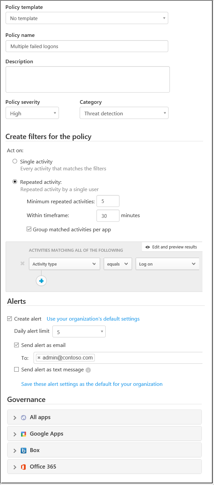

# 활동 정책

*적용 대상: Microsoft Cloud App Security*

활동 정책을 통해 앱 공급자의 API를 사용하여 다양한 자동화된 프로세스를 적용할 수 있습니다. 이러한 정책을 사용하면 다양한 사용자가 수행하는 특정 활동을 모니터링하거나 한 가지 특정 활동 유형의 예기치 않게 높은 비율을 팔로우할 수 있습니다.  
  
활동 검색 정책을 설정하면 경고를 생성하기 시작합니다. 경고는 정책을 만든 후에 수행되는 활동에 대해서만 생성됩니다.
  
  
## 사용자 지정 경고  

활동 정책을 사용하면 사용자 활동이 검색될 때 수행할 작업이나 전송할 사용자 지정 경고를 설정할 수 있습니다. 예를 들어 모든 시간을 확인하려는 경우:

- 사용자가 로그인을 시도하고 1분 내에 70회 실패
- 사용자가 7000개 파일 다운로드
- 사용자가 아프가니스탄에서 로그인됨

이러한 이벤트가 발생할 때 사용자 자신 또는 사용자에게 전송될 활동 경고를 설정할 수 있습니다. 발생한 항목의 조사를 완료할 때까지 사용자를 일시 중단할 수도 있습니다.  
  
새 활동 정책을 만들려면 다음 절차를 따르세요.  
  
1. 콘솔에서 **제어**, **정책**을 차례로 클릭합니다.  
  
2. **정책 만들기**를 클릭하고 **활동 정책**을 선택합니다.  
  
       
  
3. 정책에 이름과 설명을 지정합니다. 필요한 경우 템플릿을 기반으로 할 수 있습니다. 정책 템플릿에 대한 자세한 내용은 [정책을 사용하여 클라우드 앱 제어](control-cloud-apps-with-policies.md)를 참조하세요.  
  
4. 이 정책을 트리거할 작업이나 기타 메트릭을 설정하려면 **활동 필터**를 사용합니다.  
  
5. **활동 일치 매개 변수**에서 정책 위반이 트리거되는 경우를 선택합니다. 단일 활동이 필터와 일치하는 경우 또는 지정된 **반복된 활동**의 수가 검색되는 경우에만 트리거하도록 선택합니다.  
    - **반복된 활동**을 선택하는 경우 **단일 앱에서** 설정할 수 있습니다. 이 설정은 같은 앱에서 반복되는 활동이 발생한 경우에만 정책 일치가 트리거됩니다. 예를 들어 Box에서 30분 이내에 5번 다운로드하면 정책 일치가 트리거됩니다.  
  
6. 일치 항목이 발견될 때 수행할 **작업**을 구성합니다.  
  
다음 예를 살펴보세요.  
  
- 여러 번의 로그인 실패  
  
     짧은 기간 내에 많은 수의 실패한 로그인이 발생하는 경우 경고를 받도록 정책을 설정할 수 있습니다. 이 종류의 정책을 구성하려면 **새 활동 정책** 페이지에서 적절한 활동 필터를 선택합니다.  
  
     **활동 필터** 필드 아래에서 경고를 트리거할 매개 변수를 구성합니다.  
  
       
  
- 높은 다운로드 비율  
  
     예기치 않은 또는 평소와 다른 수준의 다운로드 활동이 있을 경우 경고를 받도록 정책을 설정할 수 있습니다. 이 종류의 정책을 구성하려면 **비율** 매개 변수에서 경고를 트리거할 매개 변수를 선택합니다.  
  
       
  
  
## 활동 정책 참조  

이 섹션에는 정책에 대한 참조 세부 정보, 각 정책에 대해 구성할 수 있는 필드와 각 정책 형식에 대한 설명이 있습니다.  
  
**활동 정책**은 클라우드에서 조직의 활동을 모니터링할 수 있도록 하는 API 기반 정책입니다. 정책은 디바이스 유형 및 위치를 포함하여 20개 이상의 파일 메타데이터 필터를 고려합니다. 정책 결과에 따라 알림이 생성될 수 있으며 사용자가 클라우드 앱에서 일시 중단될 수 있습니다.
각 정책은 다음 부분으로 구성됩니다.  
  
- 활동 필터 – 메타데이터에 따라 세부적인 조건을 만들 수 있습니다.  
  
- 활동 일치 매개 변수 - 정책과 일치하는 것으로 간주되기 위해 활동이 반복되는 횟수의 임계값을 설정할 수 있습니다.  정책과 일치해야 하는 반복된 활동 수를 지정합니다. 예를 들어 사용자에게 2분 시간 프레임에 10개의 실패한 로그인 시도가 있는 경우 경고에 대한 정책을 설정합니다. 기본적으로 **활동 일치 매개 변수는 모든 활동 필터를 충족하는 모든 단일 활동에 대해 일치를 발생시킵니다.

  - **반복된 활동**을 사용하여 반복된 활동 수, 활동이 계산되는 시간 프레임의 기간을 설정할 수 있습니다. 모든 작업이 동일한 사용자 및 동일한 클라우드 앱에서 수행되어야 함을 지정할 수도 있습니다.  
  
  
- 작업 - 위반 항목이 발견될 때 자동으로 적용할 수 있는 거버넌스 작업 집합을 제공합니다.  
  
## 다음 단계
  
[데이터 보호 정책](data-protection-policies.md)

[프리미어 고객은 프리미어 포털에서 직접 새 지원 요청을 만들 수도 있습니다.](https://premier.microsoft.com/)  
  
