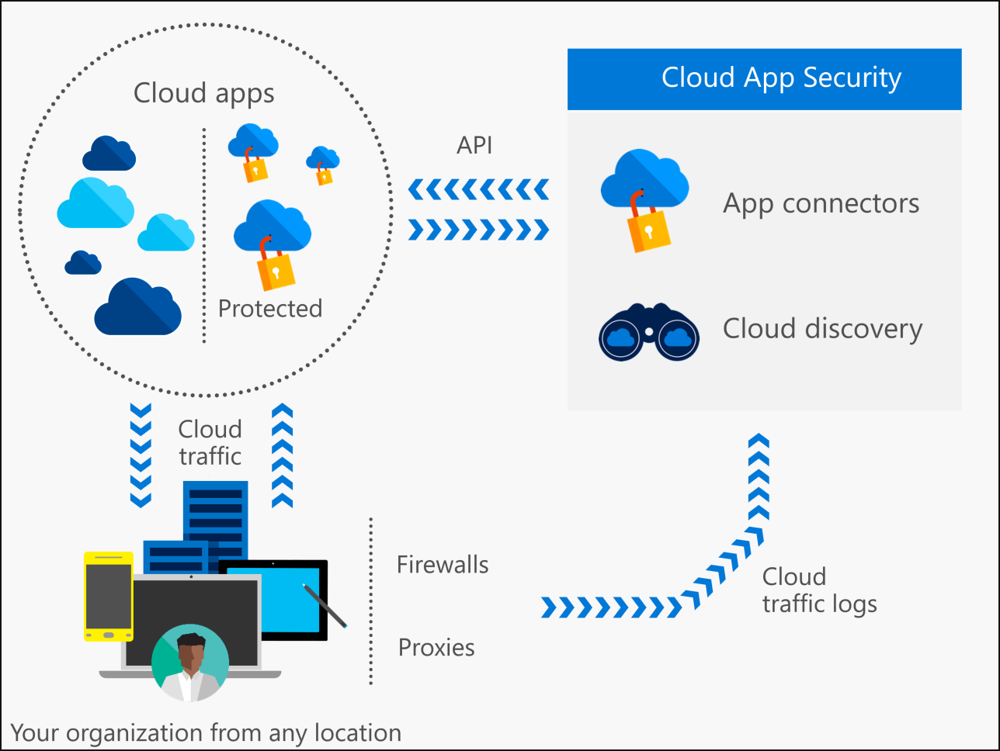

# Cloud App Security란?
 
> [!NOTE] 
> Office 365의 고급 보안 관리 기능인 Cloud App Security 기능에 대한 자세한 내용은 [고급 보안 관리 시작](https://support.office.com/article/Get-started-with-Advanced-Management-Security-d9ee4d67-f2b3-42b4-9c9e-c4529904990a)을 참조하세요. 
 
클라우드로 전환하는 동안 직원에 대한 유연성이 증가하고 IT 비용이 감소했지만 조직의 보안을 유지하는 새로운 복잡성과 문제도 발생했습니다. 클라우드 응용 프로그램의 모든 이점을 실현하려면 IT 팀은 중요한 데이터를 보호하기 위한 제어를 유지하는 동시에 액세스를 허용하는 적절한 균형을 찾아야 합니다.  
  
Cloud App Security는 Microsoft Cloud Security 스택의 주요 구성 요소입니다. 조직이 활동에 대한 향상된 가시성으로 제어를 유지하는 동시에 클라우드 응용 프로그램의 약속을 완전히 활용하는 데 도움이 되는 포괄적인 솔루션입니다. 또한 클라우드 응용 프로그램에서 중요한 데이터의 보호를 강화합니다. Shadow IT를 찾는 데 유용한 도구를 사용하여 위험 평가, 정책 적용, 활동 조사 및 위협을 중지합니다. 조직은 중요한 데이터의 제어를 유지하는 동시에 안전하게 클라우드로 이동할 수 있습니다.  
  
## Cloud App Security 프레임워크  

|       |   |   |
|-------|---|:---|
||검색|Cloud App Security로 섀도 IT를 파악합니다. 클라우드 환경에서 앱, 활동, 사용자, 데이터 및 파일과 클라우드에 연결된 타사 앱을 검색하여 표시합니다.|
||조사|클라우드 조사 도구로 클라우드 앱을 조사하여 네트워크에서 위험한 앱, 특정 사용자 및 파일을 심층 분석하고 클라우드에서 수집된 데이터의 패턴을 찾고 보고서를 생성하여 클라우드를 모니터링합니다.|
||컨트롤|네트워크 클라우드 트래픽의 제어를 최대화하기 위해 정책 및 경고를 설정하여 위험을 완화합니다. Cloud App Security를 통해 사용자가 안전하고 권한 있는 클라우드 앱 대안으로 마이그레이션할 수 있습니다.|
||보호|Cloud App Security를 통해 응용 프로그램에 권한을 부여/취소하고, DLP(데이터 손실 방지)를 적용하고, 사용 권한 및 공유를 제어하고, 사용자 지정 보고서 및 경고를 생성할 수 있습니다.|

## 아키텍처  

Cloud App Security는 다음과 같은 방법으로 클라우드와 표시 유형을 통합할 수 있습니다.  
  
-   클라우드 검색을 사용하여 클라우드 환경 및 사용 중인 클라우드 앱을 매핑하고 식별하는 표시 유형  
-   클라우드의 앱에 사용 권한 부여 및 취소 기능  
-   공급자 API를 활용하는 배포하기 쉬운 앱 커넥터를 사용하여 연결하는 앱의 표시 유형 및 거버넌스  
-   정책을 설정하고 지속적으로 미세 조정할 수 있도록 하여 연속 제어  
  
  
  
> [!NOTE]  
>  Cloud App Security가 콘텐츠 검사를 수행하면 데이터 개인 정보 보호가 적용됩니다. 데이터는 Cloud App Security 데이터베이스에 저장되지 않고 파일 레코드 및 확인된 위반의 메타데이터만 저장됩니다. 데이터 보존에 대한 자세한 내용은 [개인 정보 취급 방침](http://go.microsoft.com/fwlink/?LinkId=512132) 및 [Microsoft Trust Center](https://www.microsoft.com/TrustCenter/Privacy/You-are-in-control-of-your-data)를 참조하세요.
Cloud App Security에서는 다음과 같이 데이터를 유지합니다.
>- 활동 로그: 180일
>- 검색 데이터: 90일
>- 경고: 무제한 

이러한 원본에서 데이터를 수집한 후 Cloud App Security는 정교한 분석을 실행하며, 비정상적인 활동을 즉시 경고하고 심층 가시성을 제공합니다. Cloud App Security에서 정책을 구성한 다음 클라우드 환경에 있는 모든 항목을 보호하는 데 사용할 수 있습니다.  
  
###  클라우드 검색의 작동 방식  

클라우드 검색은 트래픽 로그를 사용하여 조직에서 사용 중인 클라우드 앱을 동적으로 검색하고 분석합니다.  
  
분석을 위해 방화벽 또는 프록시에서 로그 파일을 수동으로 업로드하여 조직의 클라우드 사용에 대한 스냅숏 보고서를 만들거나 Cloud App Security의 로그 수집기로 로그를 정기적으로 전달하여 연속 보고서를 설정할 수 있습니다.  

Cloud Discovery에 대한 자세한 내용은 [Cloud Discovery 설정](set-up-cloud-discovery.md)을 참조하세요.
  
### 앱 사용 권한 부여 및 취소의 작동 방식  

Cloud App Security를 사용하면 **클라우드 앱 카탈로그**를 통해 조직의 앱에 사용 권한을 부여/취소할 수 있습니다.  
  
Microsoft 분석가 팀은 산업 표준에 따라 순위 및 점수가 매겨진 13,000개 이상의 클라우드 앱을 포함하는 광범위한 카탈로그를 작성했으며 계속 확장하고 있습니다. **클라우드 앱 카탈로그**는 규정 인증, 산업 표준 및 모범 사례에 따라 클라우드 앱의 위험을 평가합니다. 다양한 매개 변수의 점수와 가중치를 조직의 요구에 맞게 사용자 지정할 수 있습니다. 이러한 점수를 기준으로 Cloud App Security에서 환경에 영향을 줄 수 있는 50개 이상의 위험 요소에 따라 앱의 위험도를 확인할 수 있습니다.  
  
### 앱 커넥터의 작동 방식  
앱 커넥터는 다양한 클라우드 앱 공급자가 제공하는 API를 활용하여 Cloud App Security 클라우드가 다른 클라우드 앱과 통합하고 제어 및 보호를 확장할 수 있게 합니다. 이렇게 하면 Cloud App Security가 분석을 위해 클라우드 앱에서 직접 정보를 가져올 수 있습니다.  
앱을 연결하고 보호를 확장하기 위해 앱 관리자는 Cloud App Security에 앱 액세스 권한을 부여하고, 그런 다음 Cloud App Security에서 앱의 활동 로그를 쿼리하고 데이터 및 계정과 클라우드 콘텐츠를 검색합니다. Cloud App Security는 정책을 적용하고, 위험을 검색하며, 문제 해결을 위한 거버넌스 작업을 제공할 수 있습니다.  
  
Cloud App Security는 클라우드 공급자가 제공하는 API를 활용하며, 각 앱에는 자체 프레임워크 및 API 제한 사항이 있습니다. Cloud App Security는 앱 공급자와 함께 작동하여 API 사용을 최적화하고 최적의 성능을 보장합니다. 앱이 API에 적용하는 다양한 제한 사항(예: 제한, API 제한, 동적 시간 이동 API 창 등)을 고려하여 Cloud App Security 엔진은 허용된 용량을 활용합니다. 테넌트에 있는 모든 파일 검색 등의 일부 작업에는 대량 API가 필요하므로 보다 오랜 기간 동안에 분산됩니다. 일부 정책은 몇 시간 또는 며칠 동안 실행될 것으로 예상합니다.  
  
### 정책 제어의 작동 방식  

정책을 사용하면 사용자가 클라우드에서 동작하게 하려는 방식을 정의할 수 있습니다. 클라우드 환경에서 위험한 동작, 위반 또는 의심스러운 데이터 요소 및 활동을 검색할 수 있으며, 필요한 경우 완전한 위험 완화를 위해 수정 프로세스를 통합할 수 있습니다. 클라우드 환경에 대해 수집하려는 다양한 정보 유형 및 수행할 수 있는 수정 작업 유형과 상호 관련된 여러 유형의 정책이 있습니다.  
  
## 참고 항목  

[Cloud App Security 시작](getting-started-with-cloud-app-security.md)   
[기술 지원을 받으려면 Cloud App Security 보조 지원 페이지를 방문하세요.](http://support.microsoft.com/oas/default.aspx?prid=16031)   
[프리미어 고객은 프리미어 포털에서 직접 Cloud App Security를 선택할 수도 있습니다.](https://premier.microsoft.com/)  
  
  

<!--HONumber=Oct16_HO5-->

